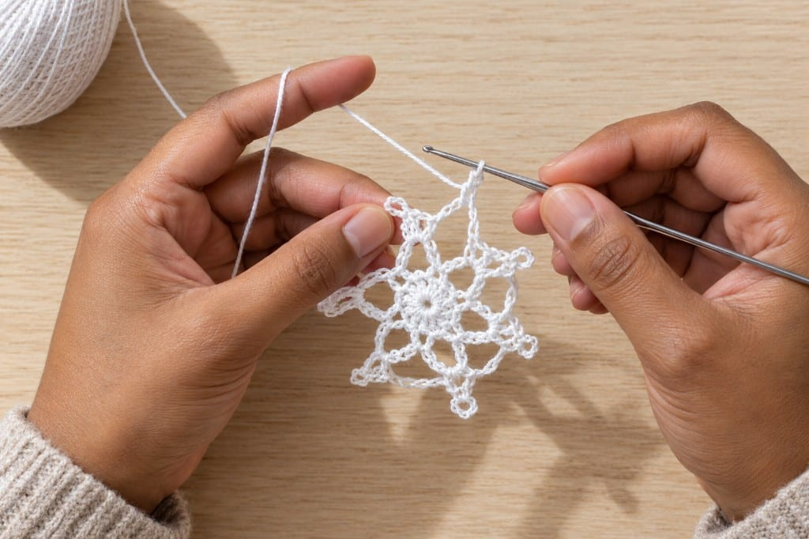
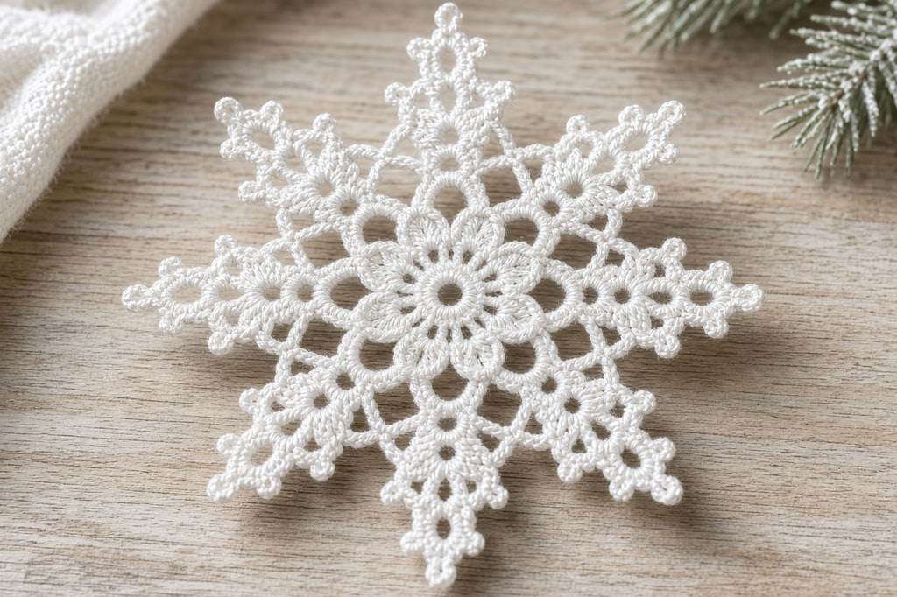
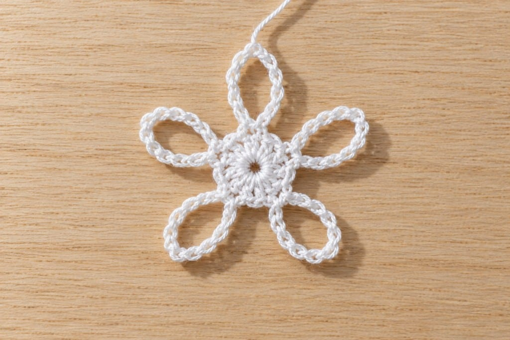
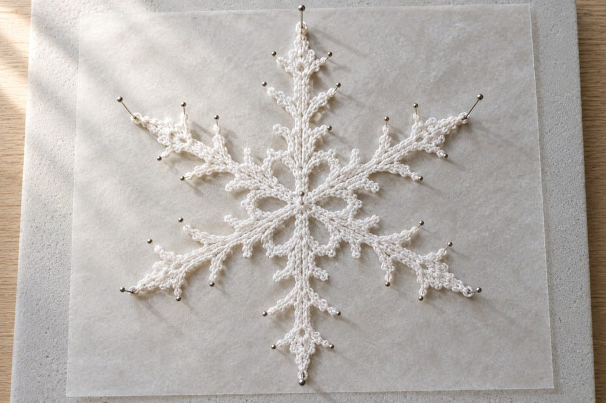

A snowflake takes about fifteen minutes to crochet. Keeping it flat is what makes this [in the round](/crochet-in-the-round) circle an ornament, with the stitches spread apart on purpose.

## What you need

- **Size 10 crochet thread** in white, or worsted yarn for a chunky version
- A **steel hook** around 1.65–1.75 mm for thread, or a 3.5–4 mm hook for yarn. Steel numbers run backwards: a higher number is a smaller hook. The [hook size chart](/crochet-hook-size-conversion-chart) has the table
- A yarn needle, rustproof pins, and a board you can pin into
- A stiffener, covered below

Abbreviations below are US terms.

## Why six points

Real snowflakes have six-fold symmetry, from the way water molecules lock as ice. Eight-point crochet flakes exist and look fine. Six reads as a snowflake at once. Five reads as a flower or a starfish. Build in multiples of six and the shape does most of the work.

## Three rounds

Every flake, however fancy, is a center, then spokes, then points.

**Round 1, the center.** Magic ring, then 12 dc into the ring. Join with a slip stitch to the top of the first dc. (12)

If the magic ring is still awkward, chain 6, slip stitch into the first chain, and work the 12 dc into that loop. The magic ring closes tighter. A gappy center is the first thing the eye hits.

**Round 2, the spokes.** Ch 5, skip one st, sc in next st. *Ch 5, skip one st, sc in next st; repeat from * around, ending with a slip stitch into the base of the first chain. (6 loops)

**Round 3, the points.** Into each ch-5 loop: 3 sc, ch 3, slip stitch into the third chain from the hook (a picot), 3 more sc. Slip stitch into the next sc between loops, then take the next loop. Repeat six times and fasten off.

For a lacier arm, replace each picot with ch 5, sc into the loop, ch 5, sc into the same loop, ch 5. Each arm ends in three spikes. The count stays six.

Make one plain flake and stiffen it before you make six ornate ones. Stiffening changes the look more than the stitch choice does.

Leave a tail and run it along the top of a few stitches. Openwork has no fabric to hide an end. More is in [weaving in ends and blocking](/weaving-in-ends-and-blocking). Weave before you stiffen. A hard tail will not thread.

## Stiffening

Off the hook the flake is soft and slightly cupped. Saturate it, pin it, and let it dry hard.

**Commercial fabric stiffener** dries clear and hard, does not attract insects, and does not yellow the way some household mixes do. Use it when the flake will stay on a tree for years. Follow the dilution on the bottle. Products differ.

**White school glue (PVA)**, roughly equal parts glue and warm water, stirred smooth. It dries mostly clear. Test a spare flake. Some glues leave a sheen on white thread.

**Sugar water**, roughly equal parts, heated until the sugar dissolves, then cooled. It dries very hard. Sugar can attract insects, and it softens in humid air. Fine for one season. Poor for a box in the attic.

**Spray starch** is the lightest hold. It will not survive a damp room. Redo it each year.

All four work, and they fail differently. If the flake matters, use commercial stiffener. For thirty on a garland, most people use glue and water.

## Blocking

1. Soak until the solution is through the thread, not just on the surface.
2. Squeeze gently. Do not wring, or the arms dry twisted.
3. Lay it on wax paper or plastic wrap so it does not stick to the board.
4. Pin **every point** at full length. Six arms means at least six pins. Pin the picots for sharper tips.
5. Match opposite arms before you leave.
6. Leave it bone dry: overnight, longer if the room is humid. Unpinning early leaves it half flat.

**Use rustproof pins.** Ordinary dressmaking pins sit in a wet solution for hours and can leave orange marks on white thread that will not wash out. Stainless steel or plastic-headed quilting pins are the safe choice.

## Mistakes

**Uneven arms.** A short arm was pinned short. Wet the flake and block it again.

**A tight, lumpy center.** Too many stitches in the ring, or the ring closed before they were spread. Twelve double crochets sit comfortably in a magic ring. Sixteen do not.

**Ends stiffened in place.** The tail dries at that angle and will not thread.

**Tension that is too tight.** The holes are the design. Dense thread reads as a small white blob at three feet. Loosen up, or go up a hook size.

**No test flake.** The result changes with the brand, the thread, and the humidity. Treat the first one as a test.

## Frequently asked

**Can I use yarn instead of thread?** Yes. A worsted flake comes out large and soft, closer to a coaster, and it needs more stiffener. Cotton holds a blocked shape better than acrylic, which springs back.

**How do I hang it?** Clear fishing line through one picot disappears on a tree. Thread stays visible. Add the hanger after stiffening, or the loop dries flat against the arm.

**Why does it cup?** Too many stitches in the outer round force a ruffle. Too few pull it into a dome. A cup means that round is too tight. A ruffle means it is too loose. Check the unstiffened flake before you blame the pins.
