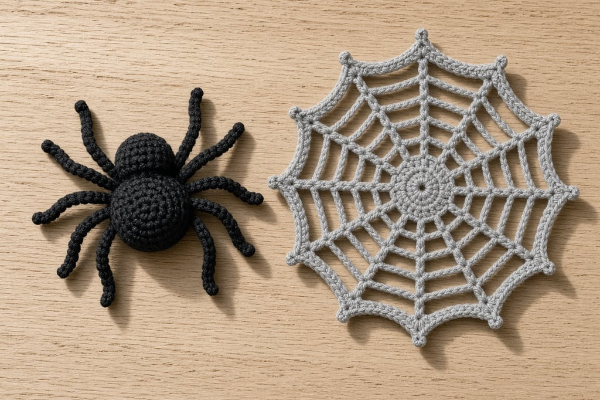
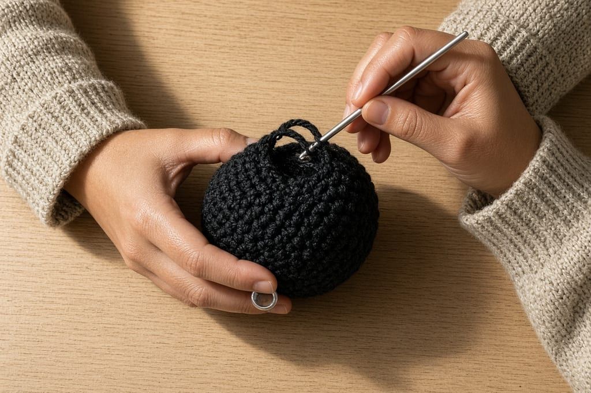
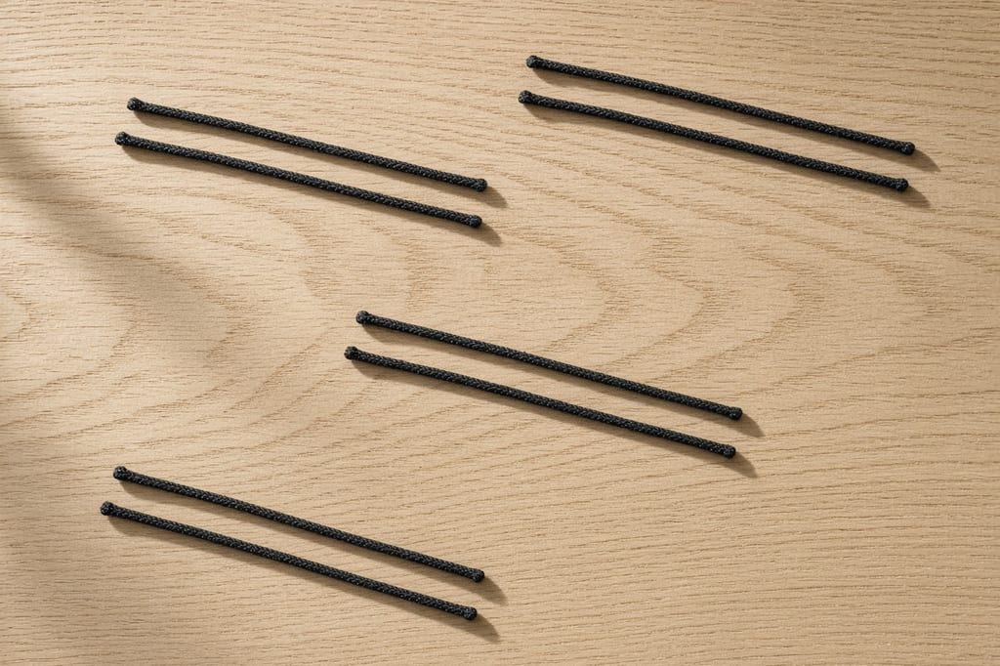
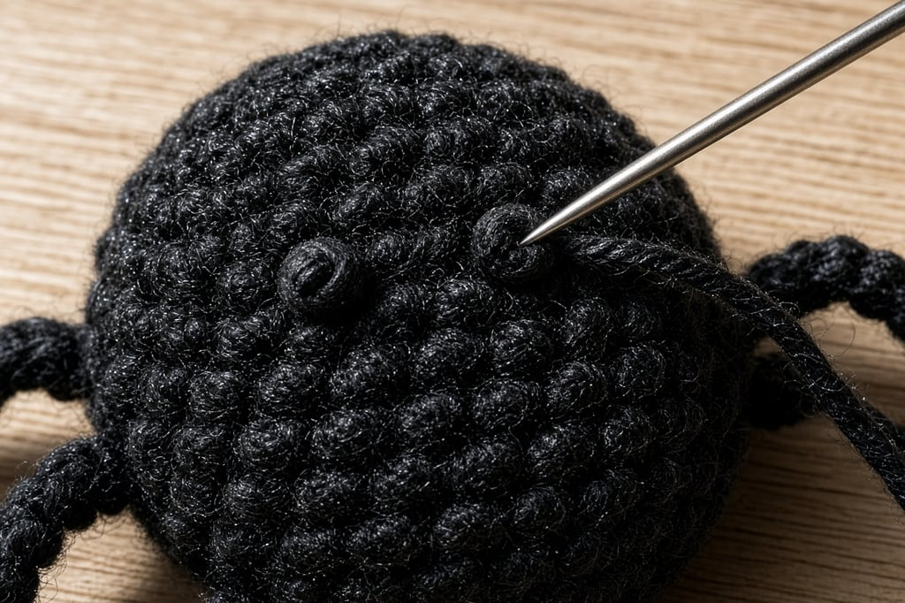
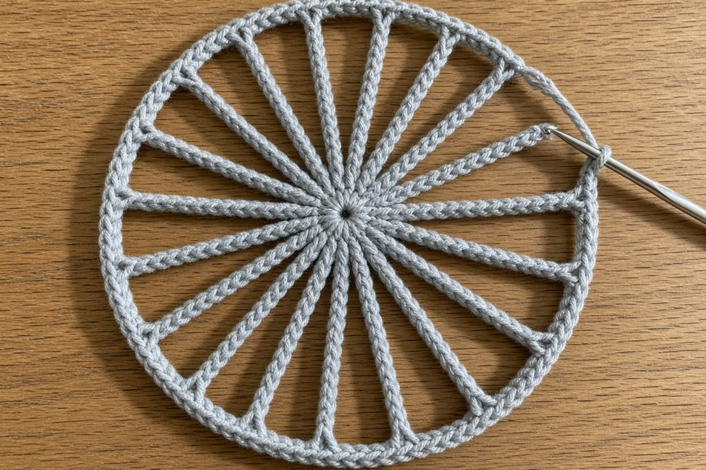
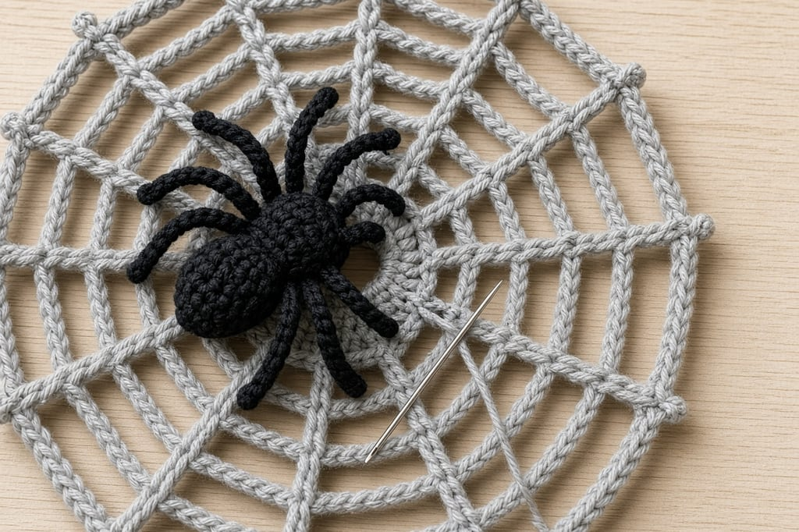

A crochet spider fails for one of two reasons: the body is a featureless blob, or the legs are all different lengths. The stitches are not hard. The proportions are.

Comfort with [magic rings and spirals](/crochet-in-the-round) is expected. Legs take patience more than new stitches.

## What you need

- Black or dark brown worsted yarn for the spider; white or gray for the web
- Matching hook ([hook size chart](/crochet-hook-size-conversion-chart)); [yarn weights](/yarn-weight-chart)
- Stuffing (spider body only)
- Yarn needle, stitch markers
- Optional: tiny bit of red or white for eyes

Abbreviations: [chart](/crochet-abbreviations-chart).

## Step 1: crochet the body

Make one sphere (stronger for a soft toy) or two flat circles sewn together (flatter for a brooch).

**Sphere version (brief).**

**Rnd 1.** Magic ring, 6 sc.

**Rnd 2.** Inc around. (12)

**Rnd 3.** *Sc, inc; repeat from * around. (18)

**Rnd 4.** *Sc in next 2, inc; repeat from * around. (24)

Work 2–3 rounds even. Decrease symmetrically back to 6, stuffing firmly before closing.

For a two-part body, make a second, smaller sphere (stop increasing at 18) and sew it to the front of the larger one as a head.

## Step 2: make eight legs in pairs

Spiders have eight legs, attached in two rows of four along the sides — not radiating like a starfish.

**Fast legs (chains).** For each leg: join yarn at the side of the body, ch 12–16, slip stitch back along the chain, fasten off and weave into the body. Keep every chain the same count.

**Sturdier legs (tubes).** Magic ring 4 sc, work even for 8–12 rounds, fasten off with a long tail, sew on. Hollow tubes bend better than stuffed ones at this size.

Pin or baste all eight positions first. From above: four legs left, four right, clustered toward the front half of the abdomen.

**Attach legs before you embroider a face you love.** Sewing eight legs means a lot of needle traffic through the body.

## Step 3: add the eyes

Two small French knots or satin-stitch dots near the front of the head section are enough. Real spiders have more eyes; crochet spiders look wrong when you embroider all of them unless you are going for scientific accuracy on a large model.

## Step 4: crochet the flat web

**Center.** Magic ring, 8 sc, join. Or ch 4, join into a ring, 8 sc into ring.

**Round of spokes.** *Ch 5, sl st in next sc; repeat from * around. (8 loops)

**Next round.** Into each ch-5 loop work: sc, hdc, dc, hdc, sc (or *ch 6, sl st into next loop*). Build outward with longer chains each round until the web is the diameter you want.

**Optional radial threads.** With a yarn needle, run straight lines from the outer edge to the center and tack them at each ring.

Block lightly if the chains curl — same idea as in [blocking basics](/weaving-in-ends-and-blocking).

## Step 5: sew the spider to the web

Sew the spider slightly off-center on the web. Add a hanging loop at the top of the web only; do not hang from a leg.

You can skip this step and use the spider alone as a toy or appliqué.

## Mistakes that read as “not a spider”

**Legs of mixed lengths.** Count chains. Write the number down.

**Body under-stuffed.** Floppy abdomen makes the legs look wrong.

**Web worked too tight.** Chain spaces should be loose.

**Using fluffy yarn for legs.** Novelty yarn sheds and hides structure.

## Frequently asked

### Is this beginner-friendly?

The body is beginner work. Eight identical legs push it to intermediate because consistency is the skill.

### Can I skip the web?

Yes. The spider stands alone.

### What yarn holds a web shape best?

Smooth cotton or cotton-blend worsted blocks crisply.

### What to make next

A [bat](/bat-amigurumi-wings-body-and-ears), a [ghost](/crochet-ghost-amigurumi-for-beginners), [Halloween granny squares](/halloween-granny-square-variations), or the [Halloween card wallet](/halloween-crochet-card-wallet).
