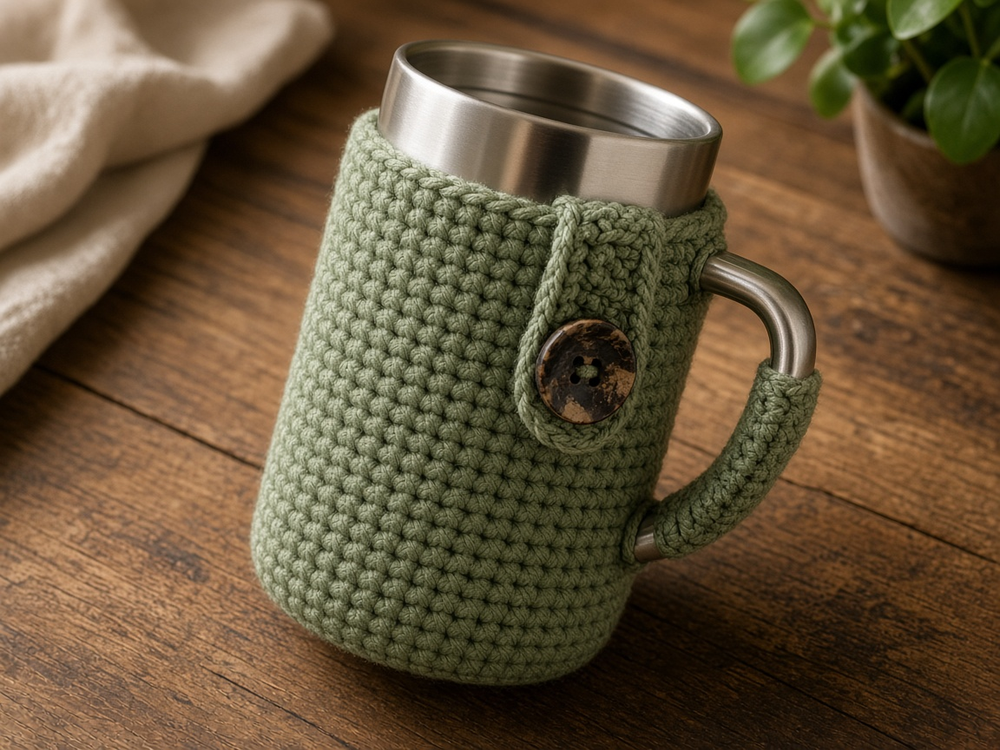
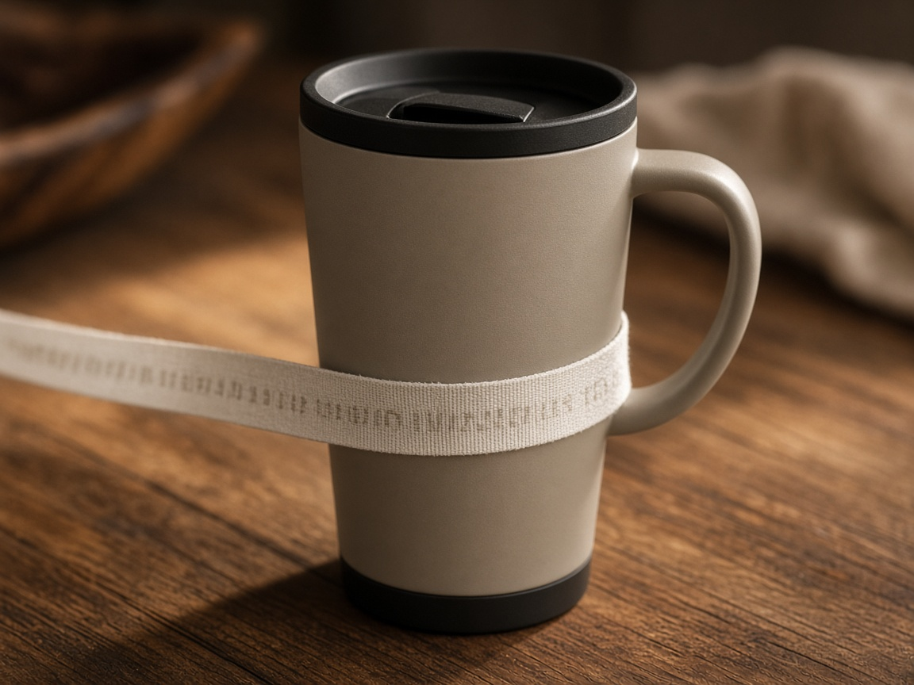
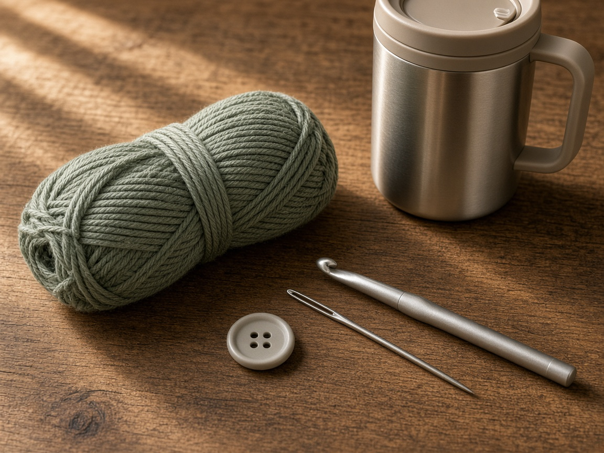
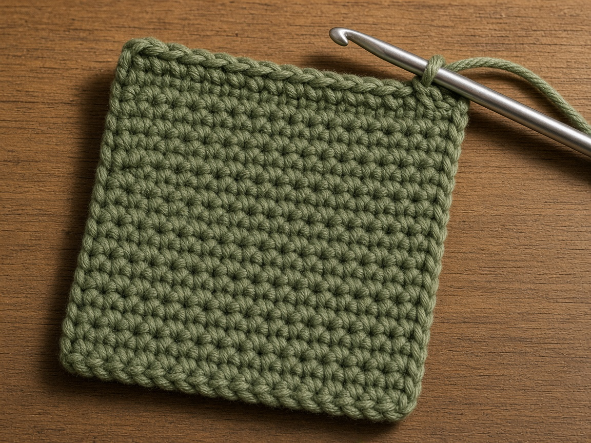
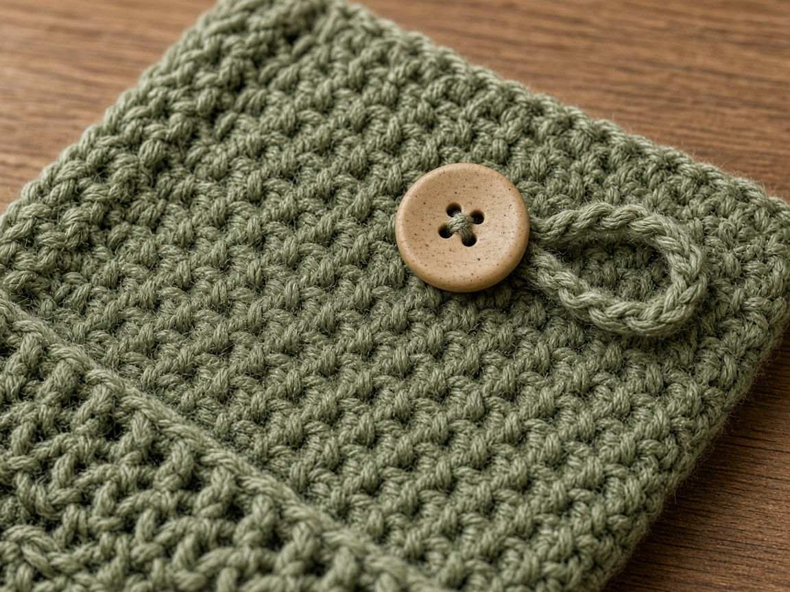
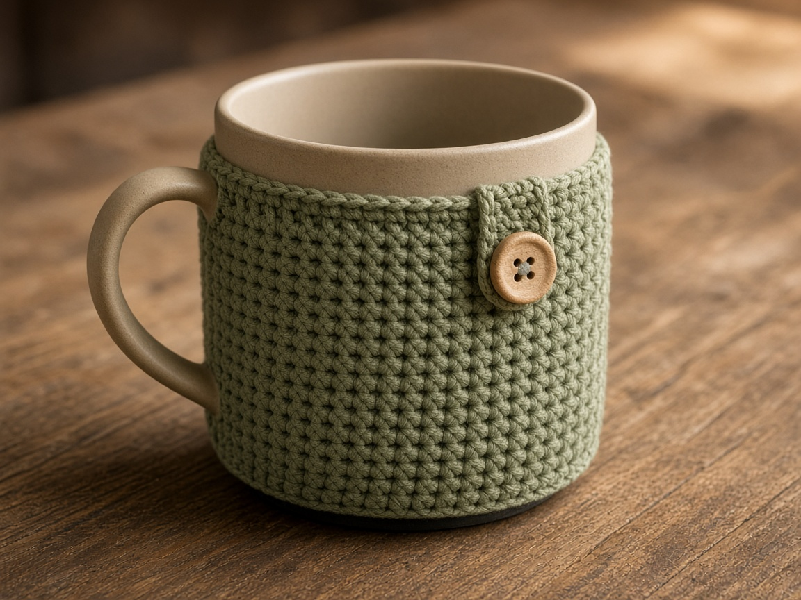

A cold tumbler sweats onto a wood table. A hot one is unpleasant to hold. A crochet sleeve is a wrap, not a thermos. It will not keep ice until evening, and it will not make a paper cup safe. It gives your hand a layer of cotton and keeps some of the sweat off the table.

This page does not fit a named brand. Cups differ. Measure the one you own. A handled cup needs a wrap with a gap, not a closed tube, or the handle has nowhere to go.

US terms. US single crochet is UK double crochet. [Abbreviations](/crochet-abbreviations-chart/). The photos are illustrations. The sleeve has not been wrapped on a measured cup in yarn.

## Measure

Three numbers, in inches:

- Height of the straight wall you want to cover, between the lid and the base. Skip the part the lid overlaps.
- Distance around the cup, not including the handle.
- How wide the handle attachment is, so the wrap can stop before it.

Example, not a fit guide: a wall **4.5 inches** tall and **9 inches** around. At the gauge below, the rectangle is **18 stitches** tall and **36 stitches** wide. Your cup changes both numbers. Divide each inch measurement by your stitches per inch.

Leave the handle outside. The wrap covers the wall and buttons at the gap next to the handle. Do not try to crochet a hole for a handle you have not measured. A buttoned gap is easier to get right.

## Materials

- Worsted cotton. About **60 yards** for the example. [Yarn weights](/yarn-weight-chart/).
- US G/6 (4.0 mm) hook, or the hook that hits gauge. [Hook chart](/crochet-hook-size-conversion-chart/).
- One button about **3/4 inch** across, sewing needle, thread, yarn needle, scissors.

Cotton. Acrylic against a sweating cup stays damp and smells. Cotton still is not waterproof. Beginner. One sitting after you have the measurements.

## Gauge (estimate)

**4 sc = 1 inch. 5 rows = 1 inch.**

Unverified on a cup. Swatch. [Gauge](/crochet-gauge/) is the difference between a wrap that buttons and a wrap that strains the button until the thread pops.

## Rectangle

Ch 1 does not count.

For the example cup, chain 19.

**Row 1:** sc in the 2nd chain from the hook and across. Ch 1, turn. (18)

**Rows 2–36:** sc in each stitch. Ch 1, turn. (18)

Eighteen stitches at 4 sc to the inch is about **4.5 inches**, the height. Thirty-six rows at 5 rows to the inch is about **7.2 inches**, which is shorter than the 9 inch circumference on purpose. The button and the handle gap take the rest. If your cup is 9 inches around and the handle eats 1.5 inches, you need about 7.5 inches of fabric. Add or remove rows until the rectangle, held on the cup, meets beside the handle with a small overlap for the button.

Do not seam it into a tube.

## Button

Sew the button near one short end, on the outside. On the other short end, join yarn and chain 8, then slip stitch back into the corner to make a loop. The loop has to reach the button when the sleeve is on the cup, not when it is flat on the table. Put the sleeve on the cup, mark where the loop lands, then sew the button there if your first guess was wrong.

## Heat and water

The sleeve is not oven use, not a microwave, and not a handle for a cup you cannot otherwise hold. If the cup is too hot for your hand, it is too hot for cotton that can scorch or for a button that can conduct heat. Set the cup down. A sweating cold cup will wet the cotton. Take the sleeve off and dry it. Do not leave damp cotton on a cup in a closed bag.

## Mistakes

**A closed tube on a handled cup.** The handle is trapped or the sleeve will not go on. This is a wrap.

**Fuzzy yarn.** It holds the sweat and pills against the cup. Cotton.

**Button placed on the flat rectangle.** The overlap changes when the cup is round. Place it on the cup.

**Covering the lid threads.** The lid will not screw on. Stop the height below the lid.

## A cup with no handle

A straight tumbler with no handle can be a tube instead of a wrap. Seam the short ends and skip the button. The circumference of the fabric should be a little smaller than the cup so it stays up. If it slides, the tube is wide. If it will not go on, it is narrow. The buttoned wrap is still the right choice when anything sticks out of the wall, including a handle, a straw bump, or a grip ridge.

## Care

Remove it from the cup. Hand wash cool. Dry flat. Put it back only when it is dry. A damp sleeve on a steel cup is a rust problem for some cups and a smell problem for all of them.

## Frequently asked

**Will it fit every travel cup?**

No. The 18 by 36 rectangle is one example at one gauge. Measure yours and redo the division.

**Can I sell them?**

Finished sleeves, yes. Do not republish the rows as your pattern. And do not sew a brand name onto a sleeve as if the cup company made it.

**Does it replace a silicone boot?**

No. Silicone is waterproof. This is cotton. Use it where a little sweat and a softer hand are the goal.

## Next

A flat sleeve for a book, same measuring idea, is the [book sleeve](/how-to-crochet-a-book-sleeve/). A sleeve for a laptop is the [laptop sleeve](/how-to-crochet-a-laptop-sleeve/).
