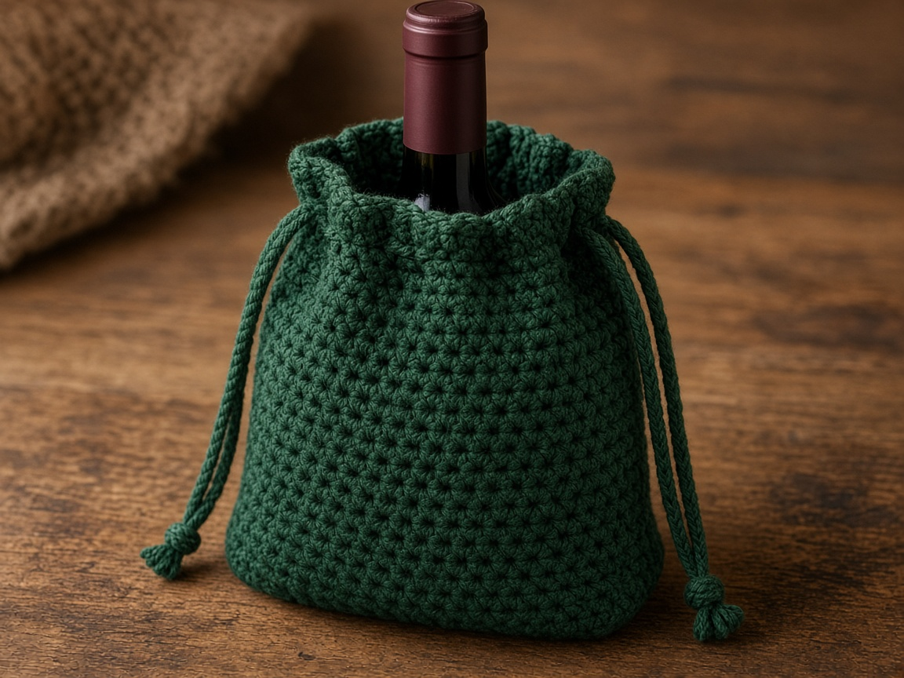
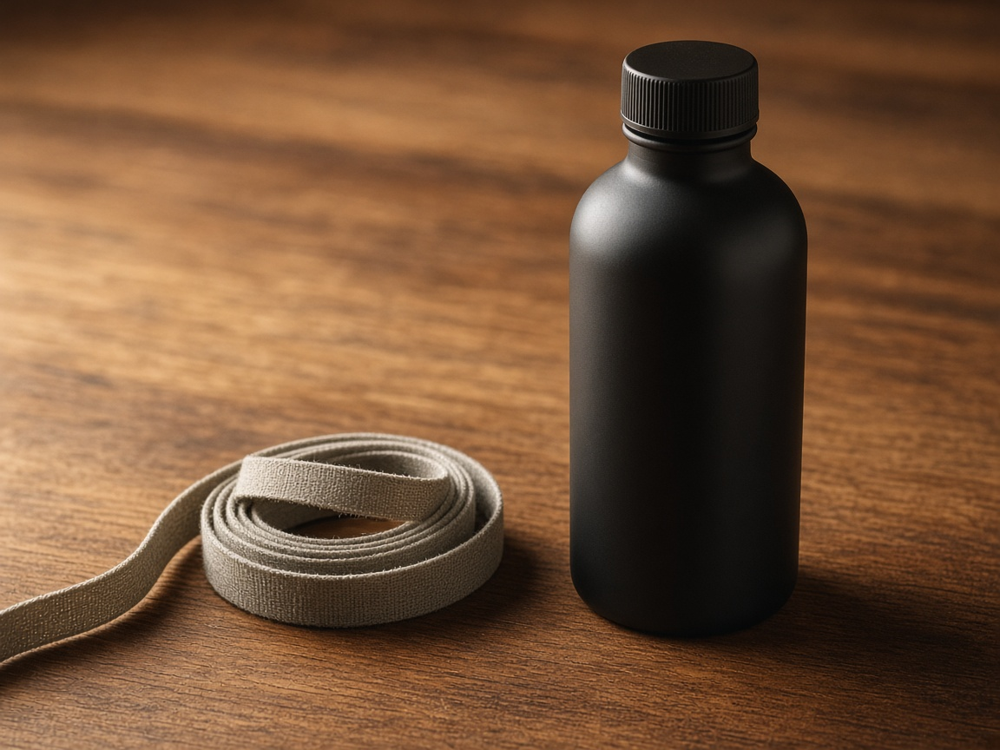
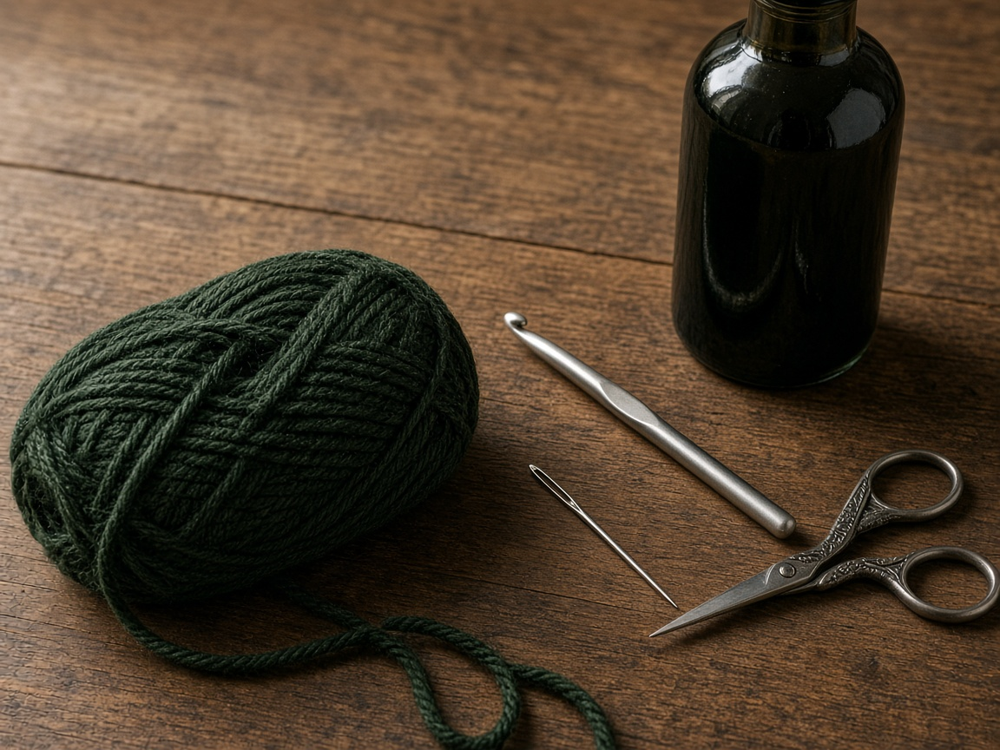
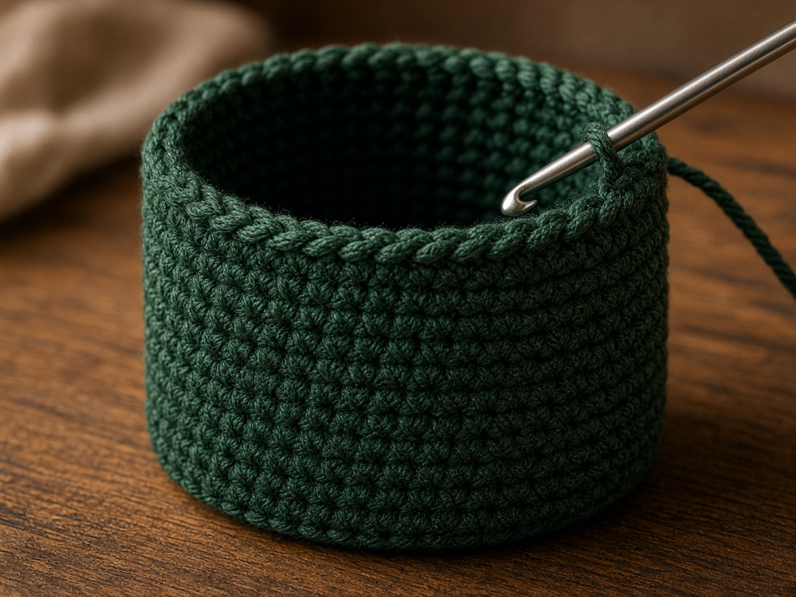
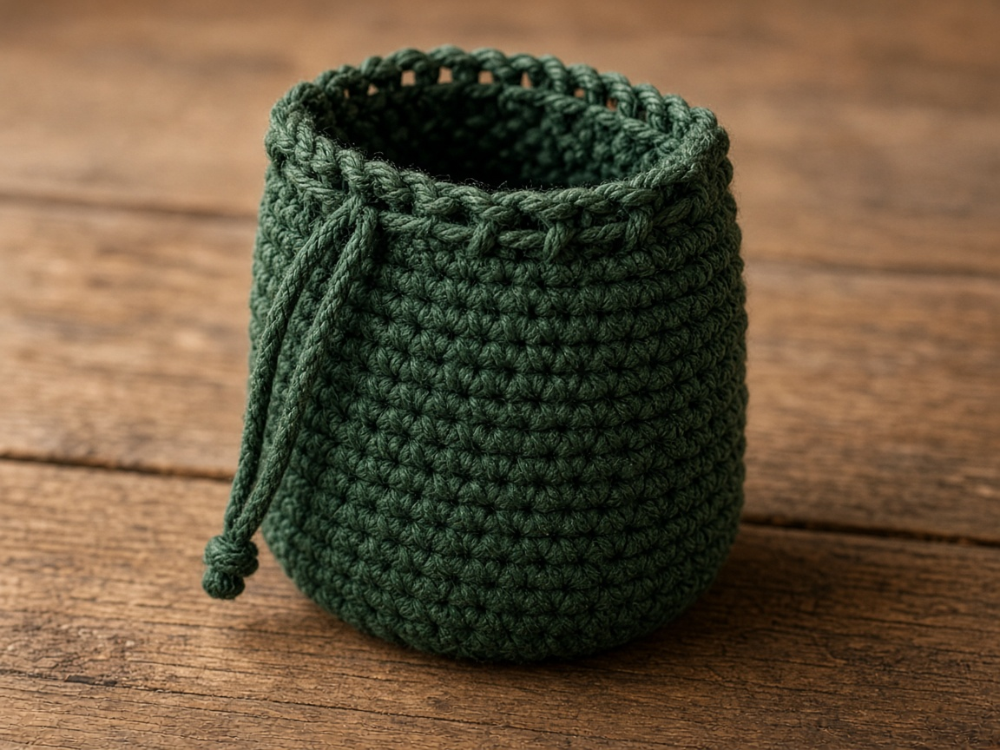
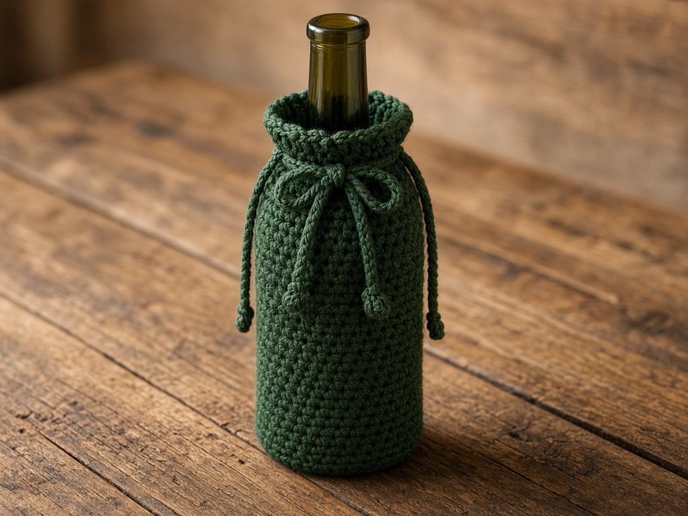

A bottle in a grocery sack knocks against everything else, and the paper handle is gone before you reach the car. A crochet wine bottle bag is a drawstring tube: a flat base, straight sides, and a cord near the top so the neck can gather. It is a soft carry sleeve. It will not keep glass from breaking if you drop it on a hard floor.

US terms. US single crochet is UK double crochet. [Abbreviations](/crochet-abbreviations-chart/). The photos are illustrations. This bag has not been yarn-tested. The inches and the yardage are estimates from the gauge below. Measure the bottle you will carry. The stitch counts are one worked example, not a size chart.

Many 750 ml bottles are near 3 inches across and 11 to 12 inches tall. That is a reason to measure, not a guaranteed fit. Bottles differ at the shoulder, the neck, and the base. Use a tape on the bottle in your hand.

## Measure the bottle

You need two numbers, in inches:

- Around the **widest** part of the bottle, not around the neck and not around the punt if the punt is narrower.
- From the bottom up to where you want the cord. That spot is often just past the shoulder, so the neck can gather and the glass still slides out.

Add about **1/2 inch** of ease to the circumference. A tube with no ease feels tidy and then sticks on the shoulder. Forcing glass through a tight round is how a bottle slips and hits the counter. If the bottle will not enter, the bag is small. Add stitches. Do not pull harder.

The example below is a tube of **40 stitches**, about **10 inches** around at the gauge, which is a little over 3 inches across. The side is planned to about **10 inches** of fabric before the eyelet rounds. Those figures are the gauge applied to the counts. They are not a 750 ml bottle that was bagged. A bottle near 3 inches across and 11 to 12 inches tall may need a different count once you include ease and the shoulder. A taller bottle needs more rounds. A wider shoulder needs more stitches. Write your two numbers on a card and keep the card with the yarn.

## Materials

- Worsted cotton. About **160 yards** for the example tube and cord. A taller or wider bottle needs more. The number is a planning estimate from the stitch count, not a weighed bag. [Yarn weights](/yarn-weight-chart/).
- US G/6 (4.0 mm) hook, or the hook that hits gauge. [Hook chart](/crochet-hook-size-conversion-chart/).
- Yarn needle, scissors, a stitch marker.

Cotton. A sweating bottle will wet it. Beginner, if you can single crochet in joined rounds. [Working in the round](/crochet-in-the-round/) is the setup.

## Gauge (estimate)

**4 sc = 1 inch. 5 rounds = 1 inch.**

Swatch in the round if you can, because a flat swatch sometimes lies about a tube. [Gauge](/crochet-gauge/) decides whether the shoulder passes. These numbers were not taken from a finished bag. If you are off, change the stitch count. Do not swap in double crochet and keep 40 stitches. The holes get larger and the diameter changes.

Ch 1 at the start of a round does not count as a stitch. Counts are for joined rounds. If you prefer a spiral, mark the start and skip the join, and still count 40 when the side begins.

## Base

The base should cover the bottom of the bottle and reach the widest circumference before the sides go straight. Slip the bottle onto the base as soon as the circle looks close. The bottle is the ruler.

**Round 1:** 6 sc in a magic ring. Join. (6)

**Round 2:** 2 sc in each stitch. Join. (12)

**Round 3:** *2 sc in the next stitch, sc in the next.* Repeat. Join. (18)

**Round 4:** *2 sc in the next stitch, sc in the next 2.* Repeat. Join. (24)

**Round 5:** *2 sc in the next stitch, sc in the next 3.* Repeat. Join. (30)

**Round 6:** *2 sc in the next stitch, sc in the next 4.* Repeat. Join. (36)

**Round 7:** *2 sc in the next stitch, sc in the next 8.* Repeat. Join. (40)

Forty stitches at 4 sc to the inch are about 10 inches around, a bit over 3 inches across. If your bottle's widest point, plus half an inch, is not 10 inches, stop at your own stitch count. Add only the increases you still need, spaced evenly. An extra increase round makes a base wider than the bottle, and the bottle will rock.

## Sides

**Next rounds:** Sc in each stitch. Join. (40)

Repeat until the side reaches the height you wrote down. The example of about 10 inches is about 50 rounds from round 1 if 5 rounds make an inch, base included. Slip the bottle in as you go. Stop when the fabric reaches the shoulder point you chose.

Keep the same count. An accidental increase turns the tube into a cone, and the cord will not gather evenly.

## Drawstring

**Eyelet round:** *Sc in the next stitch, ch 1, skip 1.* Repeat. Join. (20 sc, 20 ch-1 spaces)

**Next round:** Sc in each sc and sc in each ch-1 space. Join. (40)

**Next round:** Sc in each stitch. Join. (40) Fasten off.

**Cord:** Chain until the cord goes around the eyelet round and leaves about 8 inches free on each side for tying. Chain 80 is a starting guess from a firm chain, not a measured cord. Weave it through the eyelets and tie. The shoulder has to pass the eyelet round with the cord loose. If it will not, add stitches at the base. Do not drag the glass through.

## A different bottle

1. Widest circumference, plus 1/2 inch, times your stitches per inch. That is the side count.
2. Grow the base until you reach that count. Then stop increasing.
3. Height to the cord, times your rounds per inch. That is how tall the side is, checked with the bottle inside.
4. Chain a cord that goes around the real opening and still ties.

Many 750 ml bottles are near 3 inches across and 11 to 12 inches tall. That fact is why you measure. It is not a promise that 40 stitches and 10 inches of fabric will fit the bottle on your table.

## Mistakes

**Measuring the neck.** The neck is the narrow part. The shoulder is what gets stuck. Measure the widest part.

**No ease.** Half an inch disappears once the cotton is thick. If the shoulder sticks, add stitches.

**A cord that is too short.** It weaves in and will not tie. Chain extra. You can pull a long cord. You cannot tie a short one.

**Closing the top with stitches.** The bottle has to come back out. The only closure is the cord.

**Double crochet sides.** The fabric gets lacier and the diameter changes. Stay with single crochet if you are following these counts.

## Care

Take the bottle out. Hand wash cool. Dry flat, with the cord loose so the eyelets do not dry pinched shut. A wet bag left on a bottle can mark a paper label and can smell. Put the bottle back only when the cotton is dry.

## Frequently asked

**Will this fit a 750 ml bottle?**

Not as a promise. Many of those bottles are near 3 inches across and 11 to 12 inches tall, and many are not, once you count the shoulder. Measure the one you have.

**Can I carry any tall bottle in it?**

Only after you measure that bottle and match the stitch count. A vinegar bottle, a water bottle, and a wine bottle can share a cupboard and not share a circumference.

**Is it safe to drop?**

No. The bag is yarn. Glass still breaks. Carry it as you would carry the bottle in your hand, and do not treat the stitches as padding.

## Next

Joined rounds, increases, and a marker are the skills in [crochet in the round](/crochet-in-the-round/). A cotton wrap for a handled cup, measured the same way, is the [tumbler sleeve](/how-to-crochet-a-tumbler-sleeve/).
