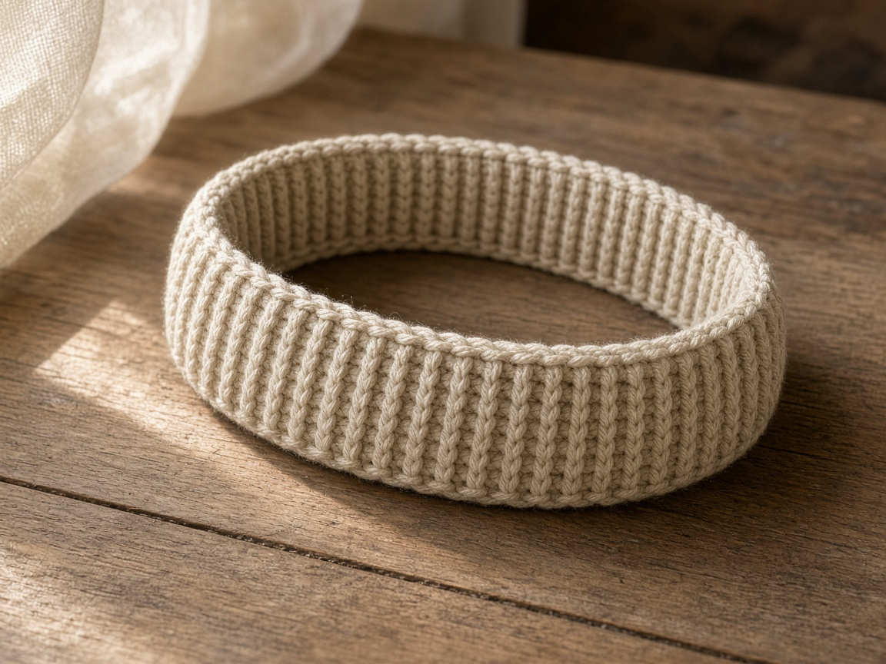
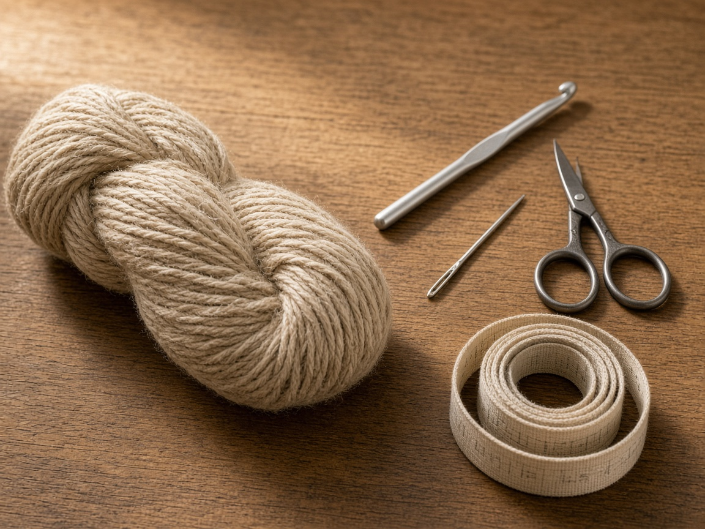
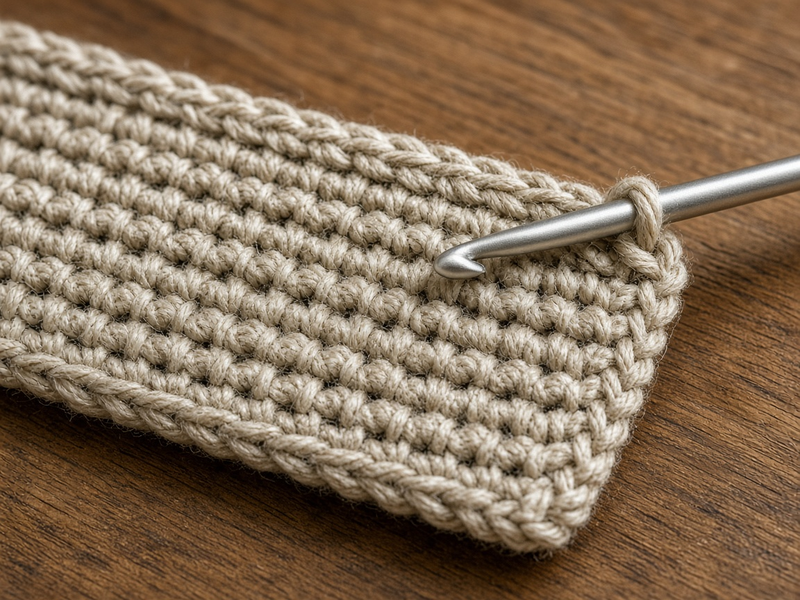
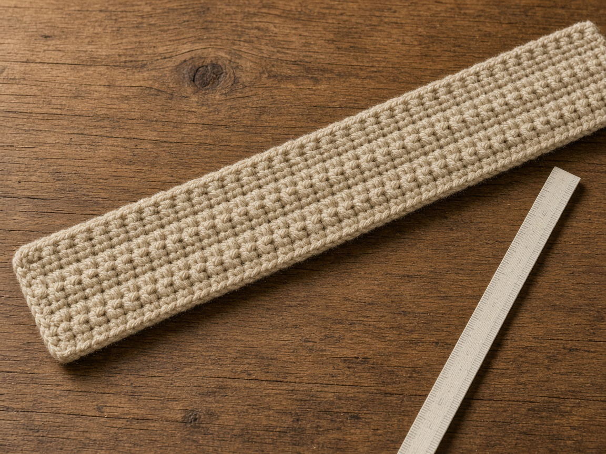
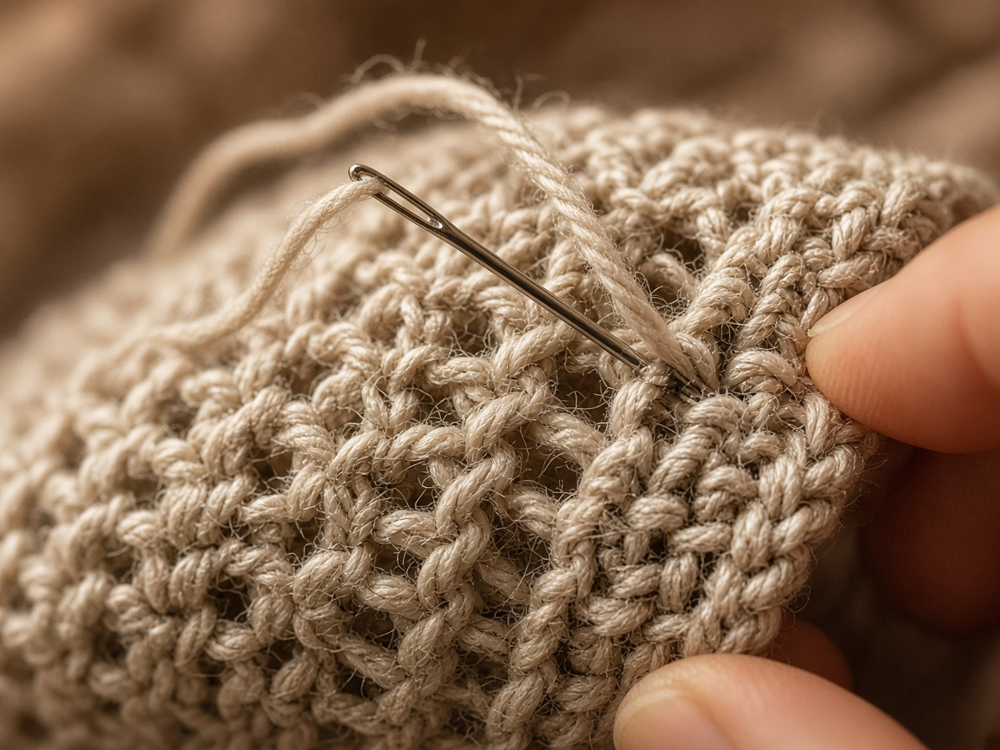
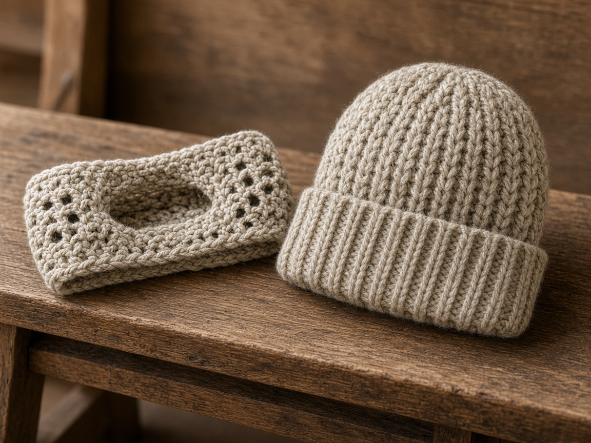

A full hat is too much in a car, and a bare head is too little on a windy sidewalk. An ear warmer covers the ears and leaves the crown alone. It is also the project to make when a [chunky beanie](/how-to-crochet-a-chunky-beanie/) feels like more knitting-adjacent commitment than you wanted.

US terms. US single crochet is UK double crochet. [Abbreviations](/crochet-abbreviations-chart/). The photos are illustrations. This band has not been worn and measured in yarn. If the seam meets before the example row count, stop. The head wins.

## Measure

Measure the head where a headband sits, across the forehead and around the back, not over the crown. Subtract about **2 inches** for a snug band that will stretch. A **22 inch** head is a **20 inch** band in the example. A very stretchy yarn needs less subtraction. A stiff cotton needs less too, or it will not go on. Check it before you seam.

## Materials

- Worsted yarn. About **80 yards** for an adult band at the gauge below. [Yarn weights](/yarn-weight-chart/).
- US H/8 (5.0 mm) hook, or the hook that hits gauge. [Hook chart](/crochet-hook-size-conversion-chart/).
- Yarn needle, scissors, tape measure.

Beginner. Under two hours once the ribbing click happens.

## Gauge (estimate)

**3.5 sc = 1 inch** in the back loop, which is a bit looser than the 4 sc cotton gauge used on the pouches. This page has not been swatched in a lab. Work 14 back-loop single crochet. If they are not about 4 inches wide, change the hook before you make 70 rows you will not use.

The width of the band is the starting chain, not the row count. The row count is the circumference.

## Band

Ch 1 does not count as a stitch.

Chain 13.

**Row 1:** sc in the 2nd chain from the hook and across. Ch 1, turn. (12)

**Row 2:** sc in the back loop only across. Ch 1, turn. (12)

Repeat row 2 until the strip, relaxed, matches your target length. At 3.5 rows to the inch, 20 inches is about **70 rows**. That row gauge is the same planning assumption as the stitch gauge and it is just as untested. Lay the strip on a tape.

Twelve stitches at 3.5 sc to the inch is about **3.4 inches** wide. Folded in half it is a narrow band. Worn flat it covers an ear. If you want it wider, chain more at the start. Do not add rows to make it wider. Rows make it longer.

## Seam

Bring the short ends together without a twist. Sew through both layers. The seam sits at the back, under the hair, where a bump is less annoying than it would be on the forehead. Weave the ends into the seam, not across the rib, or they show as a stripe.

Put it on before you weave everything in. It should cover both ears and stay put when you look down. If it slides, the band is long. If it hurts, it is short. One of those is fixed by ripping the seam and adding or removing rows. The other is what you should have checked before you sewed.

## Mistakes

**Twisted seam.** The rib spirals around the head. Open it.

**Stretching the band to hit 70 rows.** It will be loose on the head. Stop when the relaxed length is right.

**Cotton with no stretch, cut 2 inches short.** It will not go over the ears. Use 1 inch of ease, or a wool blend that actually stretches.

**Seam on the forehead.** It itches. Turn the band so the seam is at the nape.

## A wider or narrower band

The 12-stitch start is about 3.4 inches at the example gauge. That covers the ear of the example head and not much of the forehead. If you want a band that also sits on the forehead, chain 16 instead of 13 and keep 15 stitches. The row count does not change, because width and circumference are different directions. If 15 stitches make a band that buckles when you put it on, your gauge is taller than the estimate. Drop back to 12 stitches rather than forcing a stiff band over the ears.

A twisted headband, the kind that crosses at the front, is a different sew. Overlap the short ends in an X and sew the overlap flat. Do that only after the length is right. An X eats an inch of circumference. Add those rows before you sew, or the band will be tight at the ears and loose everywhere else.

## Care

Hand wash cool. Dry flat. A dryer will felt some wool blends into a band that no longer fits the person you measured. Read the label.

## Frequently asked

**Can I make it in chunky yarn?**

Yes, with a new swatch. Do not keep 12 stitches and 70 rows. Chunky at this width will be a scarf pretending to be a band. Fewer starting chains, fewer rows, same measuring step.

**Will it fit over a ponytail?**

It covers the ears, not the crown, so a ponytail at the crown is fine. A low ponytail sits on the seam. Move the seam to the side, or wear the hair down.

**Is it a beginner's first project?**

It is a good second project. The first should be a flat rectangle where a twist does not trap your head. [Basic stitches](/basic-crochet-stitches/) if the back loop is new.

## Next

Hands are the [fingerless gloves](/how-to-crochet-fingerless-gloves/). A hat with a crown is the [chunky beanie](/how-to-crochet-a-chunky-beanie/).
