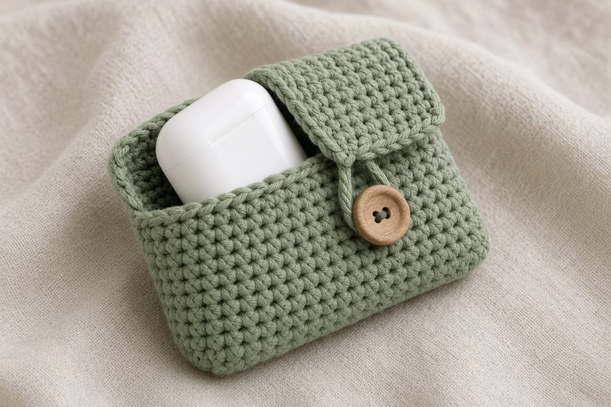
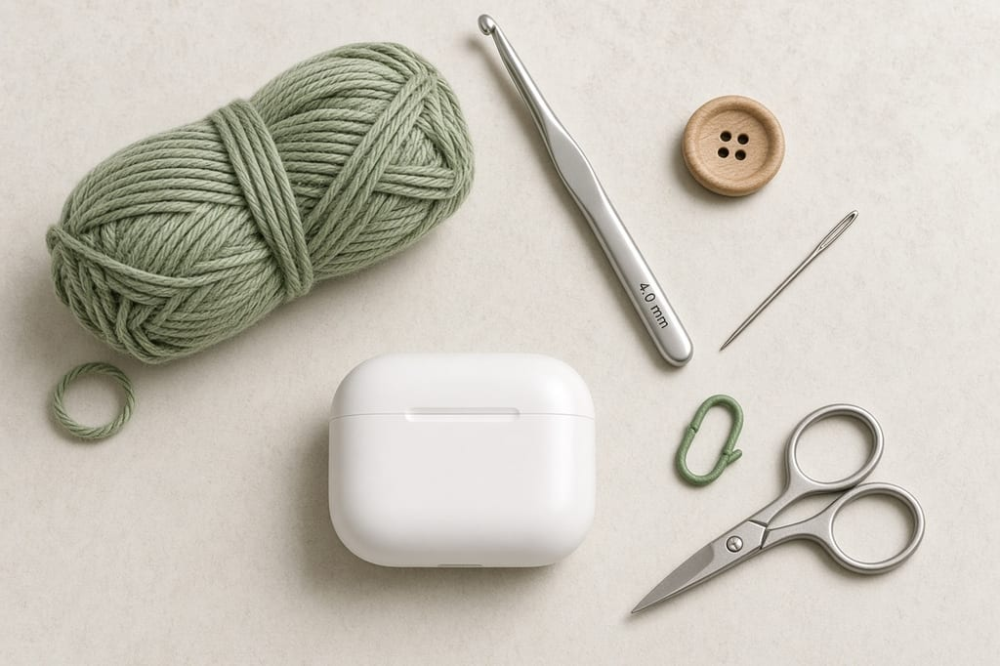
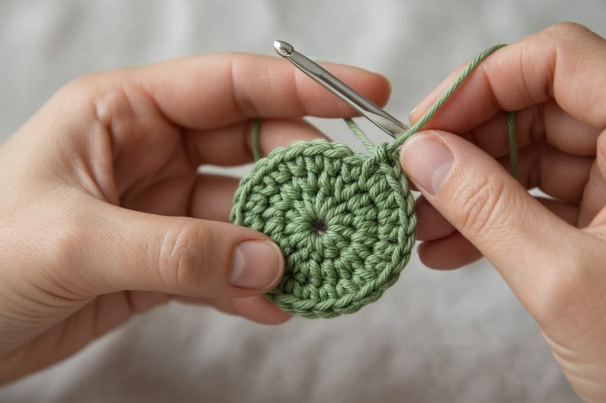
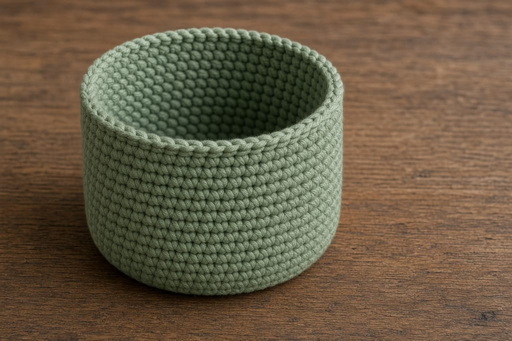
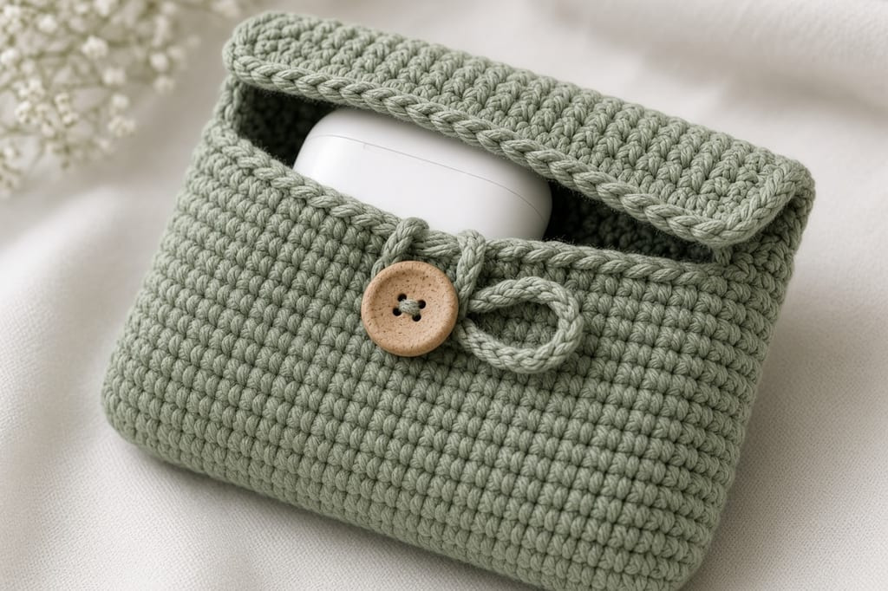
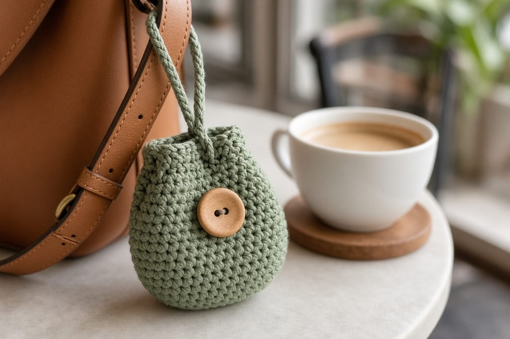

A charging case in a bag picks up lint and then the lid sticks. A small crochet pouch keeps the case in one place. It does not make the case waterproof, and it does not stop a drop onto concrete. Yarn is a cover, not a case.

This version is sage cotton with a wood button. A Halloween bat version of the same tube is already on the site: [gothic bat earbuds pouch](/gothic-bat-earbuds-pouch). Do not mix the two. This page has no ears and no wings.

US terms. US single crochet is UK double crochet. [Abbreviations](/crochet-abbreviations-chart).

Photos are illustrations. Inches are estimates. This pouch has not been fitted on a specific charging case. Measure yours before you fasten off.

## Measure first

A common charging case is a little taller than it is wide, and under an inch thick. Yours may not be. Put a tape on the case: width, height, depth. Write the numbers down. The pouch has to clear the height plus a flap, and the opening has to clear the width.

If the case is wider than about 2.2 inches, use the larger stitch count at the end. Do not force a tight pouch. A tight single-crochet tube will not stretch enough to be useful, and it can stress the case hinge.

## Materials

- Worsted cotton, sage, about **45 yards**. [Yarn weights](/yarn-weight-chart).
- US G/6 (4.0 mm) hook. [Hook chart](/crochet-hook-size-conversion-chart).
- One button about 1/2 inch across.
- Yarn needle, scissors, stitch marker.

Beginner. About 1 to 2 hours.

## Gauge (estimate)

**4 sc = 1 inch. 5 rounds = 1 inch.**

At 30 stitches, the opening is about **2.4 inches** across the flat base, and the wall of 10 even rounds is about **2 inches**. That fits many small cases. It will not fit a large over-ear headphone case.

## Body

Spiral. Marker. No join. [Crochet in the round](/crochet-in-the-round).

**Round 1:** 6 sc in a magic ring. (6)

**Round 2:** inc in each. (12)

**Round 3:** (sc, inc) 6 times. (18)

**Round 4:** (2 sc, inc) 6 times. (24)

**Round 5:** (3 sc, inc) 6 times. (30)

**Rounds 6–15:** sc in each stitch. (30)

Slip the case in. The lid should sit below the rim. If the case sticks out, add even rounds at 30 stitches until it does not. Then continue.

## Flap

The flap is worked in rows on 10 of the 30 stitches. Leave the other 20 unworked. Turn at the end of each row.

**Row 1:** sc in the next 10 stitches. Ch 1, turn. (10)

**Rows 2–5:** sc in each stitch. Ch 1, turn. (10)

**Row 6:** sc in the next 4 stitches, ch 4, skip 2, sc in the last 4. (8 sc and a 4-chain loop)

The loop uses the 2 skipped stitches as its gap. 4 + 2 + 4 = 10, so the row still sits on the same width.

Fasten off. Sew the button on the front of the tube, about 4 rounds down from the rim, centered under the loop. Button it with the case inside. The loop should reach without pulling the flap into a point. If it does not reach, chain 5 or 6 on Row 6 instead of 4, and skip the same 2 stitches.

## Optional loop

If you want it on a bag, chain 16, join with a slip stitch to the first chain, and sew that ring to the back of the rim, opposite the flap. A split ring from a key shop can go through that loop. Do not sew the loop through the buttonhole row.

## Larger case

After Round 5, work (4 sc, inc) 6 times. (36)

Work the even rounds on 36 until the case fits.

Flap: 12 stitches instead of 10. Row 6 becomes sc 5, ch 4, skip 2, sc 5.

## In a bag

The pouch keeps lint off the case. It does not cushion a drop from a counter, and it does not seal out a spilled drink. If the bag has a wet pocket, do not store the case there and expect the cotton to help.

Leave the charging port reachable or take the case out to charge. Sewing the flap shut so the case cannot fall out also means you cannot plug it in. The button is the closure. Use it.

A keychain loop is optional and it changes how the pouch hangs. On a bag strap it will knock against your hip. On a belt loop it sits better if the loop is the short chain from the pattern, not a long strap you added because the photo looked cute.

## Mistakes

**A flap on the full round.** That is a lid with no opening. Stop after 10 stitches on Row 1.

**Counting the turning chain as a stitch.** It is not. The count stays 10.

**Fuzzy yarn inside.** It sheds into the speaker mesh. Use smooth cotton.

## Care

Empty the case. Hand wash cool. Dry flat. The pouch can get damp. The electronics should not. Take the case out before any wash.

## Frequently asked

**Will it fit every brand?**

No. Measure. The 30-stitch tube is a starting size, not a universal one.

**Can I skip the button?**

A drawstring works if you would rather not sew. Use the eyelet round from the [ghost coin pouch](/how-to-crochet-a-ghost-coin-pouch) on an even stitch count.

**Is it safe in the rain?**

No. Single crochet has gaps. Do not put the case in a wet pouch and call it protected.

## Next

Cords that live next to the case are a separate scrap project once you want them tidy. A flat phone sleeve, sized to a measured phone, is [how to crochet a phone case](/how-to-crochet-a-phone-case).
