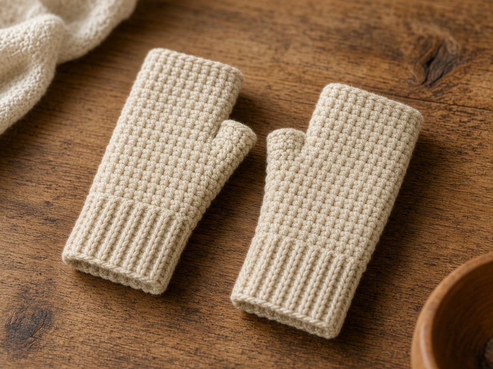
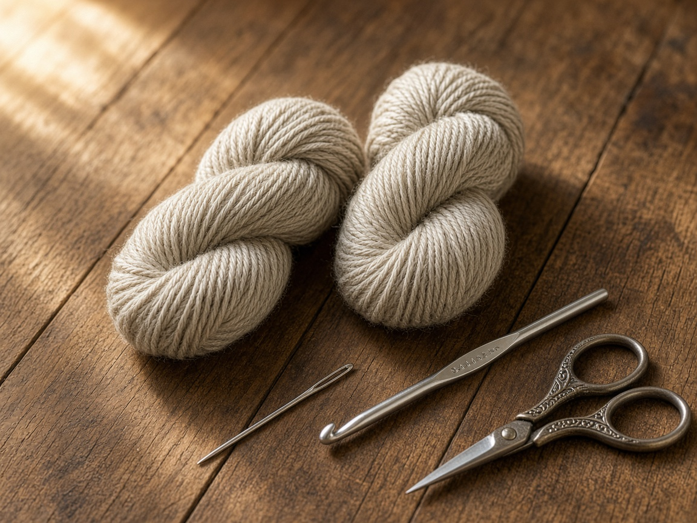
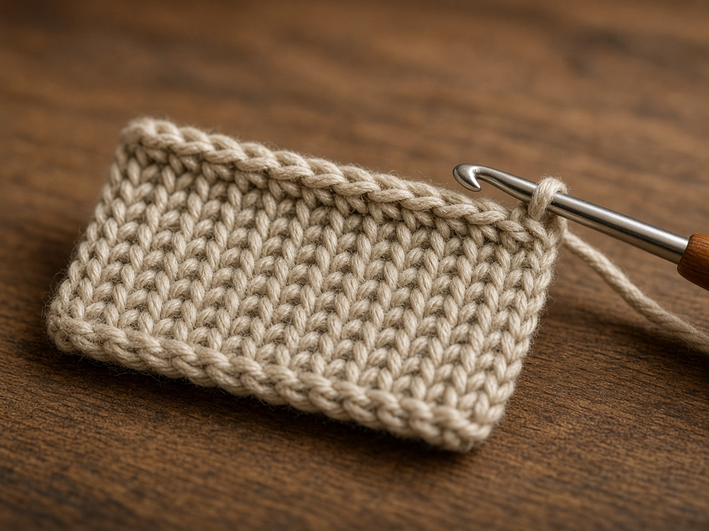
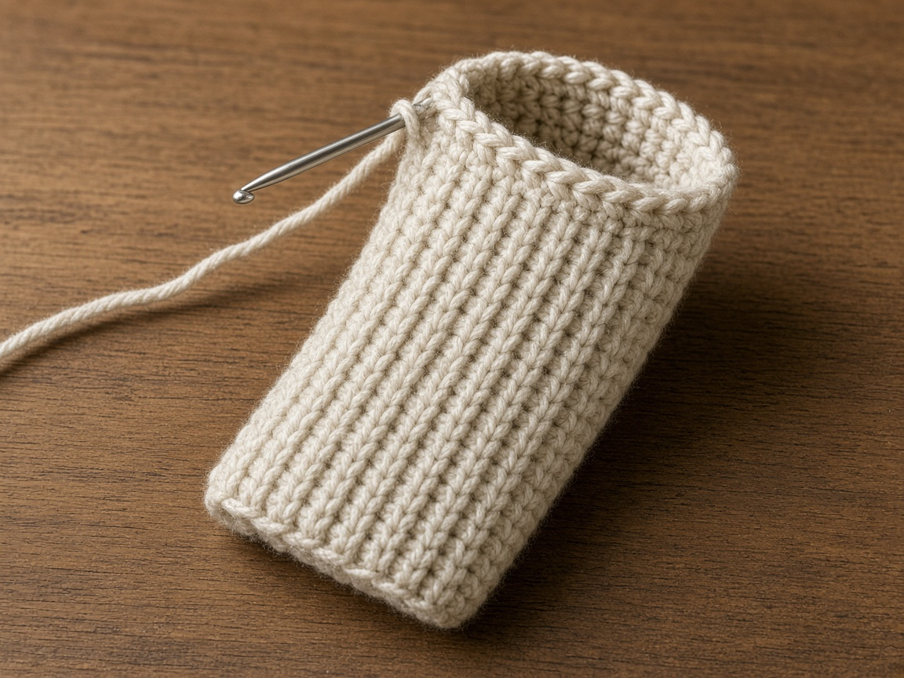
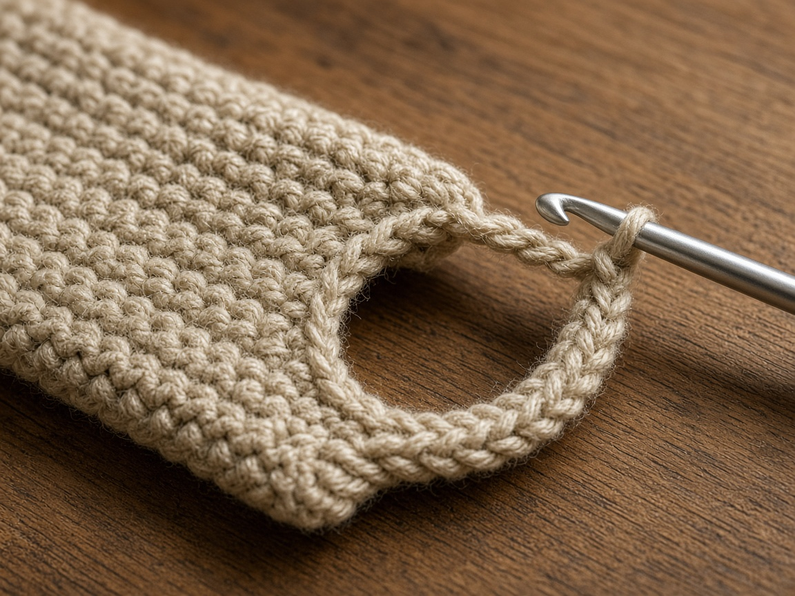
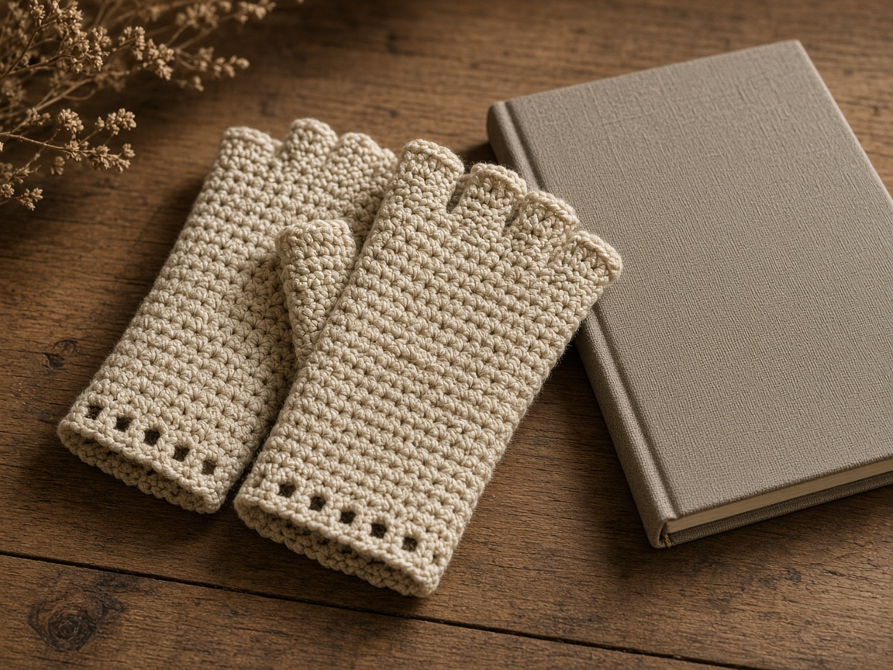

Full gloves are a small geometry problem. Fingerless gloves are a tube with one hole. You keep your fingers for a phone and still cover the palm in a cold car. Make two. One warm hand is a joke you will not find funny in January.

US terms. US single crochet is UK double crochet. [Abbreviations](/crochet-abbreviations-chart/). The photos are illustrations. This pair has not been worn and measured in yarn. Try the first glove on before you copy it for the second hand.

## Measure

Three numbers:

- Around the knuckles, not including the thumb. Snug, not tight.
- From the wrist bone to the base of the fingers.
- Around the thumb at the widest part, if you want the hole checked.

Subtract about **1/2 inch** from the knuckle measurement so the glove stays on. Example: a **7.5 inch** hand becomes a **7 inch** tube. At the gauge below that is **28 stitches**. Your hand is probably not this hand. Do the division with your own gauge.

## Materials

- Worsted yarn. About **140 yards** for the pair in the example. [Yarn weights](/yarn-weight-chart/).
- US G/6 (4.0 mm) hook, or the hook that hits gauge. [Hook chart](/crochet-hook-size-conversion-chart/).
- Yarn needle, scissors.

Beginner, and fiddly only at the thumb. A pair is an evening if you try them on.

## Gauge (estimate)

**4 sc = 1 inch. 5 rounds = 1 inch.**

Same planning gauge as the cotton pouches on this site, and just as untested on a hand. [Gauge](/crochet-gauge/) here is comfort. Too tight and the thumb hole cuts. Too loose and the glove rotates until the hole is on the back of the hand.

## Cuff

The cuff is a short ribbed band, the same idea as the [ear warmer](/how-to-crochet-an-ear-warmer/), joined into a loop.

Ch 1 does not count.

Chain 9.

**Row 1:** sc in the 2nd chain from the hook and across. Ch 1, turn. (8)

**Row 2:** sc in the back loop only across. Ch 1, turn. (8)

Repeat row 2 until the band fits around the wrist. The example hand uses **28 rows**, about 7 inches at 4 rows to the inch. The wrist is often smaller than the knuckles. A cuff that fits the wrist and a hand that needs 28 stitches can both be true. Seam the cuff to the wrist. You will increase on the first round of the hand if the knuckle count is higher.

Sew the short ends. Do not twist the rib.

## Hand

Join yarn on the long edge. Pick up one stitch per row.

**Round 1:** sc in each row end. Join. (28 in the example)

If you need more stitches for the knuckles, increase evenly on this round until you hit your number. Then stop increasing.

**Rounds 2–8:** sc in each stitch.

Slide it on. The tube should cover the palm and stop before the fingers. Add or skip rounds. Write down the round where the thumb wants to leave, because the second glove has to match.

## Thumb hole

On the next round, chain 6, skip 4 stitches, and sc in the rest. The chain bridges the thumb. Four skipped stitches at this gauge are about an inch. A larger thumb needs a longer chain and more skipped stitches. Do not guess from the photo.

Next round: sc in each stitch of the chain and in each sc. You are back to a closed tube, with a hole underneath the chain. Work 4 more rounds, or until the glove covers the knuckles and still lets the fingers bend. Fasten off.

The thumb itself is not cased in. This is fingerless on purpose. If the hole cuts into the web of the thumb, the chain was too short or you placed it too low. Frog those two rounds. It is a small frog.

Make the second glove the same, and check that the thumb holes are mirror images. Two right hands are a common outcome if you always start the hole on the same side of the seam. The seam stays on the outer wrist for both, and the hole moves to the inner thumb.

## Mistakes

**One glove.** You will lose it, and you cannot orient a single glove anyway.

**Thumb hole on the seam.** The seam bulk plus a hole is a lump. Put the seam opposite the thumb.

**Cuff as tight as the knuckles.** The wrist measurement and the hand measurement are different. Do not force one number to do both jobs.

**Double crochet for speed.** The holes chill the hand and catch on a coat zipper. Stay with single crochet.

## Care

Wash the pair together so they pill the same way. Dry flat. Do not hang them by the thumb hole. The chain stretches and the hole becomes a mitten you did not plan.

## Frequently asked

**Can I drive in them?**

That is the point of leaving the fingers out. If the fabric is too thick to feel a button, you used bulky yarn on a worsted count. Start over in worsted.

**What about a child?**

Measure the child. Do not shrink the adult 28 stitches by a vibe. A thumb hole that is too small is worse on a small hand.

**Will they work with the ear warmer?**

Yes. They are separate objects. The [ear warmer](/how-to-crochet-an-ear-warmer/) does not change this gauge.

## Next

A hat, if the ears were not enough, is the [chunky beanie](/how-to-crochet-a-chunky-beanie/). A scarf that also covers the head is the [hooded scarf](/how-to-crochet-a-hooded-scarf/).
