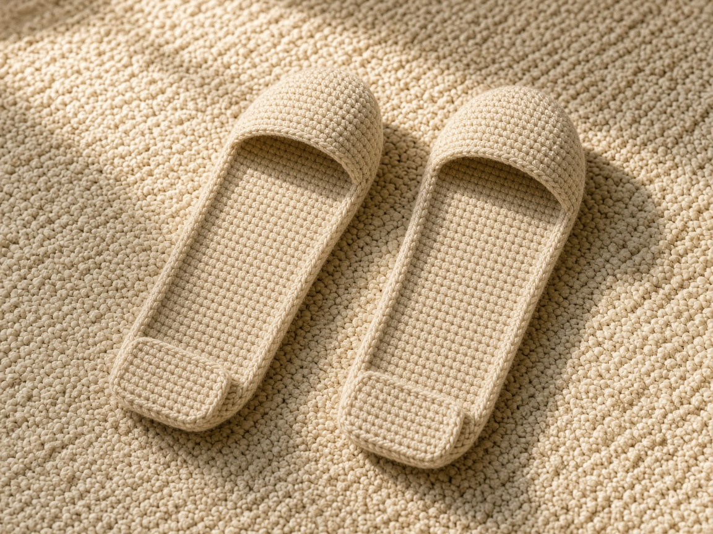
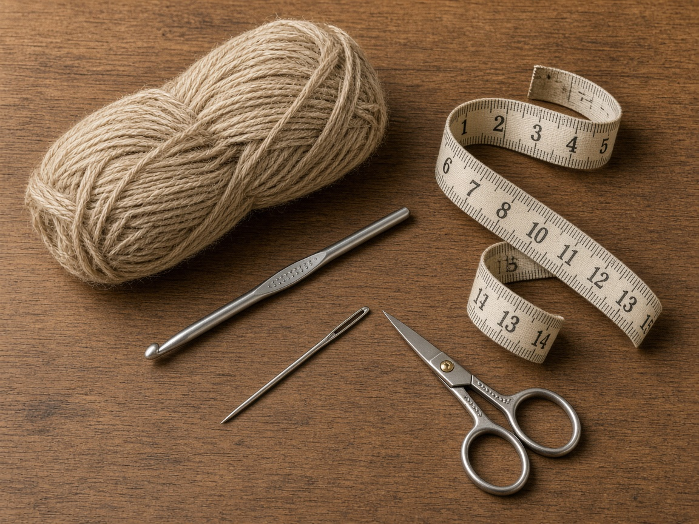
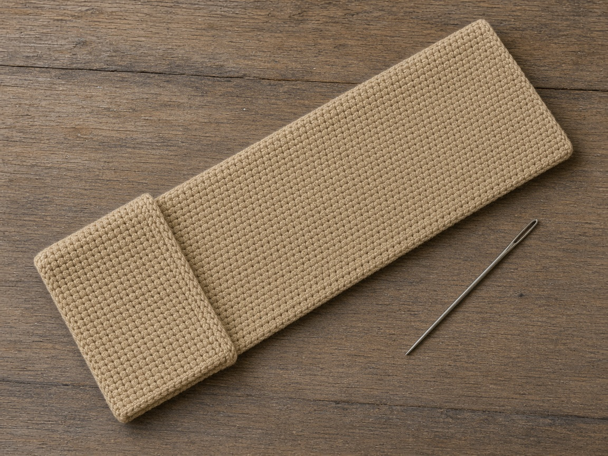
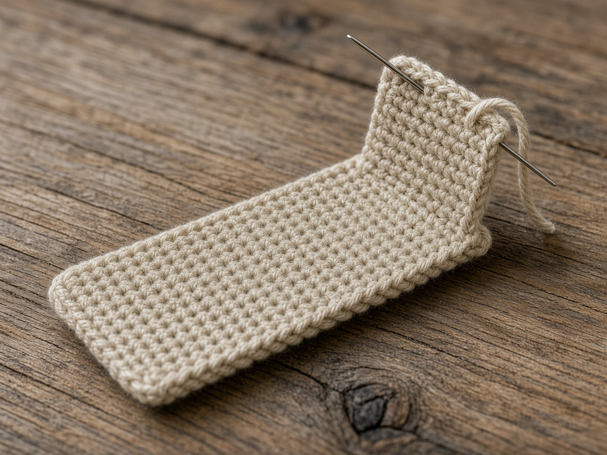

Socks slide on a wood floor, and a bought slipper is often a size you do not have. A crochet sole can follow the foot you measured. It will still slide on tile, wood, and any hard floor. These are indoor slippers for a rug or a carpet. They are not shoes, and they are not safe on stairs.

US terms. US single crochet is UK double crochet. [Abbreviations](/crochet-abbreviations-chart/). The photos are illustrations. This pair has not been worn or measured in yarn. The inches and the yardage are estimates from the gauge. Measure your own foot before you chain.

## Measure

Stand on a piece of paper if you can, and measure:

- Length, from the back of the heel to the longest toe.
- Width, across the widest part of the foot.

The example sole is planned for a foot about **9 inches** long and about **3.5 inches** wide. The sole is a little longer than the foot, about **9.6 inches**, so the toes are not curled over the end. A stretchy yarn may need less ease. Check the sole against the foot before you sew the upper on.

At the gauge below:

- Width in inches times 4, rounded to a whole number, is the stitch count. The example is 3.5 times 4, which is **14 stitches**.
- Length you want for the sole, in inches, times 5, rounded, is the row count. The example is about 9.6 inches, which is **48 rows**.

Chain one more than the stitch count. A 10 inch foot that wants a sole near 10.5 inches is about **53 rows**. A 4 inch width is **16 stitches**. The upper uses the same stitch count as the sole.

This shape is a clog: a sole, a cap over the toes, and a short tab at the heel. The instep stays open. It will not stay on a foot that is much narrower than the sole.

## Materials

- Worsted yarn. About **200 yards** for the example pair. A longer foot needs more. This was not weighed off a finished pair. [Yarn weights](/yarn-weight-chart/). Wool or a wool blend is warmer. Cotton washes and feels cooler. Either one slides on a hard floor.
- US G/6 (4.0 mm) hook, or the hook that hits gauge. A larger hook makes a looser, floppier sole. [Hook chart](/crochet-hook-size-conversion-chart/).
- Yarn needle, scissors, a scrap of yarn to mark the toe.

Beginner. Make one sole and check it on the foot before you make the second.

## Gauge (estimate)

**4 sc = 1 inch. 5 rows = 1 inch.**

This is a planning number, not a swatch from this page. [Gauge](/crochet-gauge/) is the size of the sole. Work 14 sc for 20 rows. If that piece is not about 3.5 inches wide and 4 inches tall, change the hook or change the stitch count. Do not follow 48 rows and hope.

Single crochet is the fabric because it is the densest of the [basic stitches](/basic-crochet-stitches/). A taller stitch makes a sole that stretches wider the first time you stand up.

## Sole

Make 2. Ch 1 does not count as a stitch.

Chain 15 for the example width.

**Row 1:** Sc in the 2nd chain from the hook and across. Ch 1, turn. (14)

**Rows 2–48:** Sc in each stitch. Ch 1, turn. (14)

The written slipper is a rectangle sole, a short toe cap, and a short heel tab, with the instep left open. If a drawing looks more closed than that, follow the row counts. Fourteen stitches at 4 sc to the inch is about **3.5 inches**. Lay it on the foot. The longest toe should sit inside the far end, with a little fabric left. If the toes hang off, add rows. If the width is tight, start over with more stitches. Do not stretch a narrow sole and sew the upper on.

Mark one short end with a scrap of yarn. That end is the toe. You need the mark because the two ends look the same, and sewing both pieces to one end is a common way to ruin the pair.

Count the rows on the second sole. Hold the two soles together. They should match. A sole that is four rows short is a different size, even if it looked close on the table.

## Toe cap

The cap uses the same stitch count as the sole. The example is 14.

Chain 15.

**Row 1:** Sc in the 2nd chain from the hook and across. Ch 1, turn. (14)

**Rows 2–16:** Sc in each stitch. Ch 1, turn. (14)

Sixteen rows at 5 rows to the inch is about **3.2 inches** over the toes. It should stop before the instep bends. If you cannot flex, stop earlier and make the second cap to that same row count.

Sew row 1 of the cap to the 14 stitches of the marked toe end. Sew each side of the cap to the sole edge for the depth of the cap, about 16 row-ends on the example. The last row of the cap stays open. That opening is where the foot enters toward the toe.

Use the same yarn and a yarn needle. Sew through both layers without pulling so hard that the sole cups. A cupped sole will rock when you stand.

## Heel tab

Chain 15.

**Row 1:** Sc in the 2nd chain from the hook and across. Ch 1, turn. (14)

**Rows 2–8:** Sc in each stitch. Ch 1, turn. (14)

Eight rows is about **1.6 inches**. Sew row 1 to the short end that is not the toe. Sew the sides of the tab down about 8 row-ends on each side of the sole. The top of the tab stays open. It is there to catch the heel, not to wrap the ankle.

On a 48-row sole, the cap and the tab leave about **24 rows** of each side unsewn, about **4.8 inches** of opening. If the foot will not go in, you sewed the cap too far down the sides. If the heel walks out, the tab is too short or it is on the toe end.

Make the second slipper to the same counts. These rectangles are the same for a left and a right foot. If you later add a strap on one side only, mirror it on the other slipper.

Crochet soles are slippery on hard floors. Tile, wood, laminate, and a wet bathroom floor are all a fall risk. Stairs are worse. Wear these on carpet or a rug. A sock underneath does not add grip. If you need grip, that is a separate sole material meant for slippers, sewn on by you and tested on your floor. This pattern does not include one.

## Mistakes

**Measuring a shoe instead of the foot.** Shoe sizes hide the length you need. Use a tape on the foot.

**Skipping the toe marker.** Both ends of the rectangle look alike. Two caps on one end and a bare heel means you start the sewing over.

**A different count on the second sole.** Count rows. Do not trust that they look like a pair.

**Wearing them in the kitchen.** The sole feels textured in your hand and still slides on a hard floor. Keep them on the rug.

## Care

Hand wash cool. Dry flat. Do not hang them by the heel tab. If the dry sole is suddenly longer than the foot, the next pair needs fewer rows.

Do not wear them wet. A damp sole is slicker, and it can mark a pale floor.

## Frequently asked

**Will this fit every foot?**

No. Fourteen stitches and 48 rows are the example at the gauge above, for a foot near 9 inches long and 3.5 inches wide. Measure, then change the counts.

**Can I sell them?**

Finished slippers, yes. Do not republish the rows as your pattern. Tell the buyer they slide on hard floors. A slipper sold without that warning is a bad product, even if the stitches are right.

**Are they warm enough for a cold floor?**

On a rug, a wool worsted sole is warmer than cotton. Neither one replaces a shoe outside, and neither one is safe on a bare hard floor just because the room is cold. A different winter project that does not touch the floor is the [chunky beanie](/how-to-crochet-a-chunky-beanie/) or the [fingerless gloves](/how-to-crochet-fingerless-gloves/).

## Next

A hanging stocking with a heel and a toe, not sized as a shoe, is the [Christmas stocking](/how-to-crochet-a-christmas-stocking/). For the rest of a cold evening, the [ear warmer](/how-to-crochet-an-ear-warmer/) and the [hooded scarf](/how-to-crochet-a-hooded-scarf/) stay off the floor entirely.
