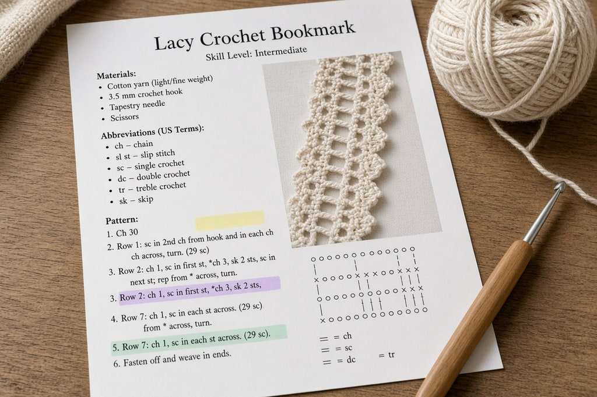
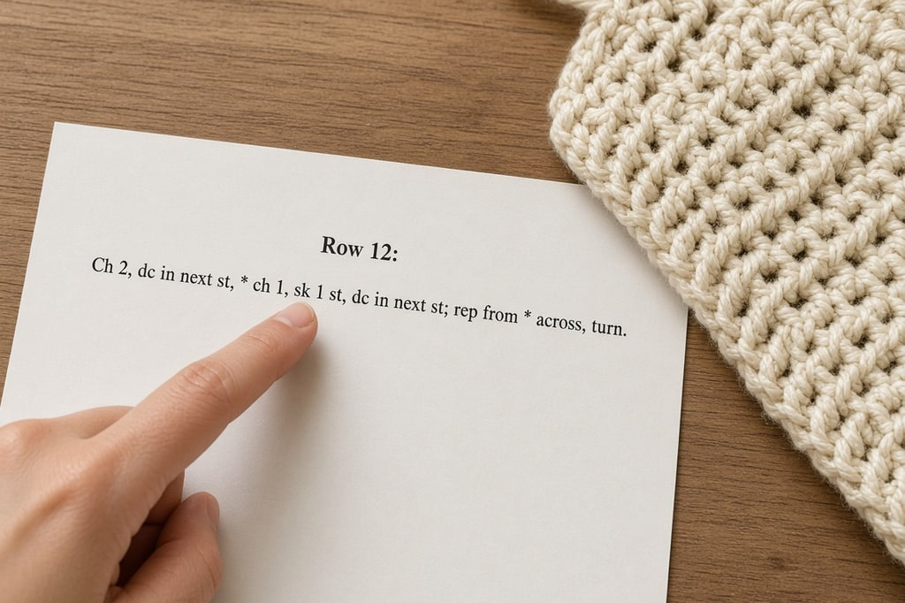
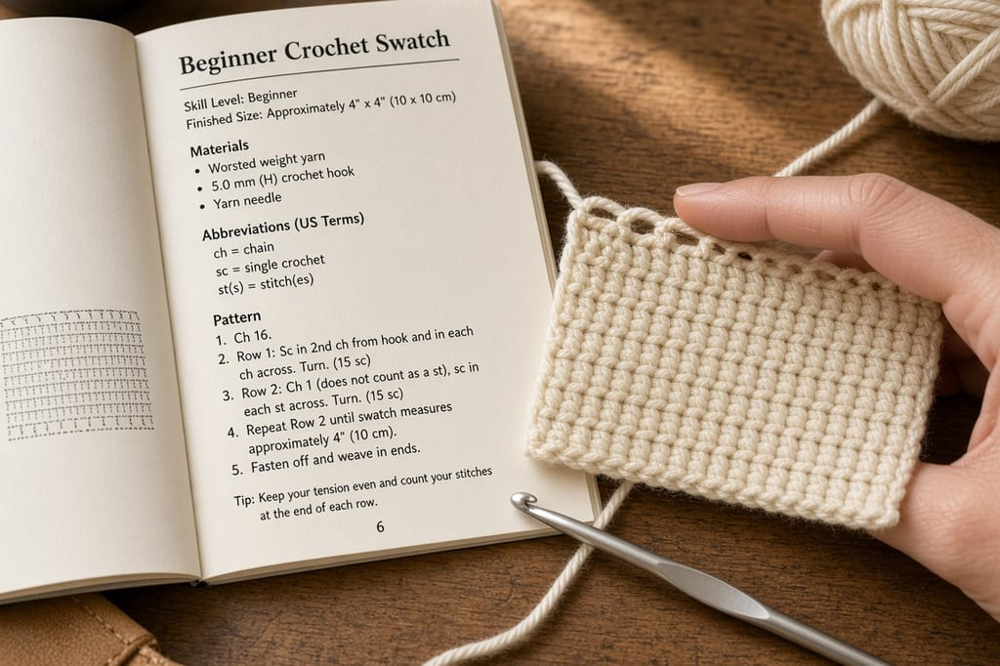

Crochet patterns are shorthand. The line below is a whole row, and the rest of a pattern uses the same pieces.

> **Row 4:** Ch 3 (counts as dc), *2 dc in next st, sk 1 st, rep from * across, turn. (24 sts)

## Materials, hook, and gauge

Read the pattern once before you chain. Check for a special-stitches section, for US or UK terms, and for the construction: flat and seamed, or in one piece in the round, brim first or crown first.

**Yarn.** Weight (a number from 0 to 7, or a name such as worsted or DK), total yardage, and the yarn used. Buy by yards or meters, plus ten percent. Ball sizes differ by brand.

**Hook.** Trust the millimeters, not the letter. Letters differ by maker. The [hook size chart](/crochet-hook-size-conversion-chart) converts them.

**Gauge.** Often `16 sc and 18 rows = 4 inches`, in the pattern stitch. The same yarn and hook can still differ by an inch or two, because one person holds the yarn tighter. Swatch a bit larger than 4 inches square, lay it flat, and count the middle 4 inches. Too many stitches: go up a hook size. Too few: go down.

Skip the swatch for blankets, scarves, dishcloths, coasters, and bags. Do not skip it for hats, sweaters, mittens, socks, gloves, or amigurumi. Loose amigurumi lets the stuffing show.

**Notions and size.** Markers, a tapestry needle, safety eyes, buttons. A hat listed at 21 inches will not become 23 inches after you finish it. Check the finished size first.

## US or UK terms

US and UK names are shifted by one. A US single crochet is a UK double crochet. If `sc` appears, the pattern is US. UK terms have no single crochet. If you see `htr`, it is UK. The table is in the [abbreviations chart](/crochet-abbreviations-chart). If you cannot tell, assume US terms.

## Rows and rounds

**Rows** are flat. You turn, and the next row starts with a turning chain.

**Joined rounds** end in a slip stitch and a chain up, which leaves a seam. **Spiral rounds** never join. Amigurumi usually works this way. Mark the first stitch and move the marker each round. Without it, you end up counting from the beginning.

## Reading a single line

The sample row, in order:

- **`Row 4:`** This row only. `Rows 4–12:` means the same instruction for each of those rows.
- **`Ch 3 (counts as dc)`** Chain 3 for height, and count that chain as the first double crochet. If it says the chain does not count, you also work into the first stitch.
- **`*` through `rep from *`** The part you repeat.
- **`2 dc in next st`** Two double crochets in one stitch. That is an increase.
- **`sk 1 st`** Skip the next stitch.
- **`rep from * across`** Keep alternating those two instructions to the end of the row.
- **`turn`** Flip the work.
- **`(24 sts)`** A checkpoint. You should have 24 stitches. It is not another stitch to make.

**Punctuation.** Parentheses group stitches that all go in one place: `(2 dc, ch 1, 2 dc) in next st`. Parentheses at the end of a row are the count instead. Brackets repeat a set number of times: `[sc, ch 1] x 6`. An asterisk marks a repeat that runs to the end of the row or round. A number before a stitch is how many to make (`3 dc`). A number inside the name is one combined stitch (`dc3tog`, a decrease made from three stitches).

## Count your stitches

Use the number at the end of the row. Most drift comes from three places. The turning chain, if you sometimes count it and sometimes do not. The last stitch, easy to miss in double crochet, where the previous chain looks like fabric. Losing one stitch every row is usually that. And `ch-2 sp`, which means the hole, not the chain stitches. The wrong choice changes the count and the gauge.

If you are off by a stitch or two, undo to the last row you trusted. Compensating on the next row does not fix it.

## Several sizes, and repeats

Garment patterns stack sizes in one line:

> Ch 60 (66, 72, 78)

The first number is the smallest size. The rest follow the size list at the top. Before row one, circle every number that belongs to your size.

`Worked in multiples of 6 + 2` tells you how to change the width yourself. The starting chain must be a multiple of six, plus two. Chains of 20, 26, 32, and 38 work. A chain of 25 does not, and the pattern breaks at the end of the first row.

## Mistakes

Skipping the notes, where the designer warns that the piece runs small, the first round is awkward, or the yarn splits. Guessing a special stitch instead of reading the definition at the top. Mixing size numbers. And redoing a row that cannot add up before you search the designer's name plus "errata."

Some lace and Japanese patterns use a diagram. The symbols draw the shape.

## Frequently asked

**Do I need every abbreviation first?** No. Keep the [abbreviations chart](/crochet-abbreviations-chart) open. About fifteen of them stick within a month.

**Why does it get narrower or wider?** The count is drifting, usually at the turning chain or the last stitch. Count each row until you see which.

**What is a sound first pattern?** Flat, one color, worsted, in rows of one stitch. A dishcloth or a simple scarf. Leave shaping and color changes for later.
