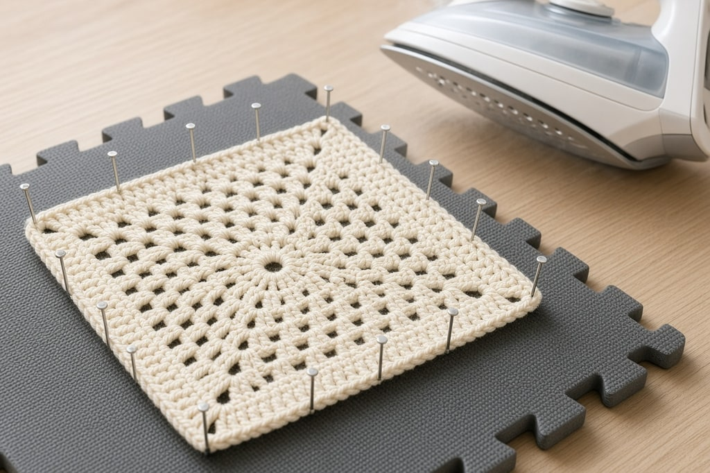
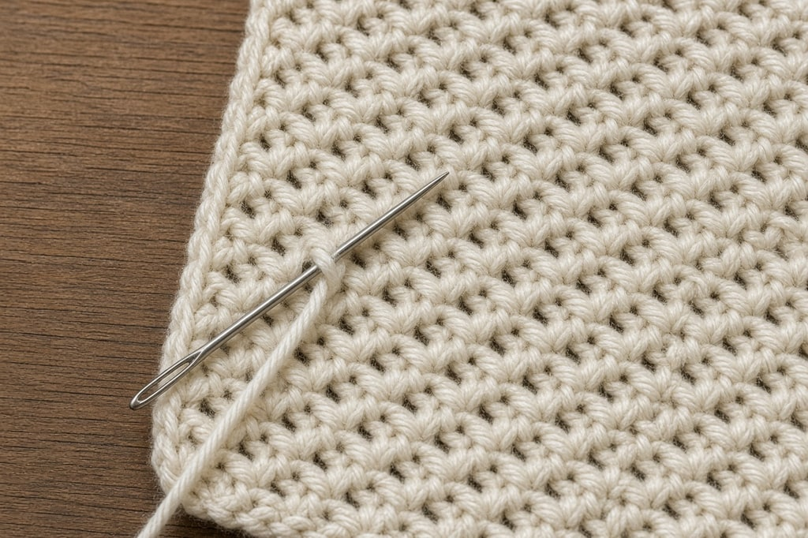
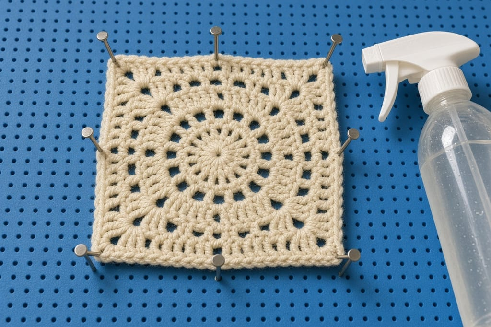

Finishing is most of the difference between a project that looks handmade and one that looks homemade. Three jobs: secure the ends, block if the fiber will respond, and join the pieces.

## Fastening off

Cut the yarn, leaving at least a six-inch tail. Leave eight to ten inches if you will seam with it. Yarn over, pull the cut end all the way through the last loop, and tug gently. That secures the stitch. The tail is the next job.

## Weaving in ends

A tail threaded straight through the fabric works loose with wear and washing. You want friction and a change of direction.

Use a blunt tapestry needle so it slides between the plies instead of splitting them.

1. On the wrong side, run the needle through the backs of four or five stitches, following the stitch bumps.
2. Change direction. Weave back through several more stitches, on a different path.
3. Split a ply once on the way back if you want it permanent.
4. Trim close, then stretch the piece gently in both directions so the cut end pulls inside.

The direction change is what holds. A straight pass can slide back out. A pass that reverses on itself cannot.

Run dark tails through dark stitches and light tails through light. A navy end through a cream stripe shows a shadow, and it gets worse after the first wash.

**Amigurumi.** Weave across the inside, catching stitches, then bring the needle out and back in through the same spot before you trim. Toys are handled hard, and once the piece is stuffed there is no wrong side to check.

On a striped piece, weave as you go. Leaving every end until the last row is where projects stall.

## Blocking

Blocking means wetting or steaming a finished piece, shaping it, and letting it dry that way. Stitches relax, tension evens out, lace opens, and edges lie flat. Whether it works depends on the fiber.

| Fiber | Does blocking help? | Method |
| --- | --- | --- |
| Wool and wool blends | Dramatically | Wet block |
| Cotton and linen | Yes, noticeably | Wet block |
| Acrylic | Barely, unless steamed | Steam, with care |
| Superwash wool | Yes, but it can grow | Wet block, do not stretch far |
| Novelty and fuzzy yarns | No | Skip it |

### Wet blocking

For wool and cotton:

1. Soak in cool water with a little wool wash for fifteen to twenty minutes, until the piece is fully wet.
2. Lift it supporting the whole weight. A wet piece that hangs will stretch and stay stretched.
3. Press the water out between towels. Do not wring or twist.
4. Lay it on a flat padded surface and pin it to the measurements you want, with rustproof pins.
5. Let it dry completely before you unpin. A day, sometimes two. Unpinning early undoes the work.

This is what turns a curling granny square into a flat one, and it changes lace.

### Steam blocking

Acrylic does not respond to water. Heat changes it permanently. Hold a steam iron above the piece, in short bursts, and keep it moving. Do not let the iron touch the fabric. Acrylic melts, flattens, and goes shiny. Some people do this on purpose for drape. It is often called killing acrylic, and you cannot undo it.

Bobbles, popcorns, and puffs lose their dimension if pressed. Steam them from farther away, or skip them.

Skip blocking for acrylic blankets, dishcloths, amigurumi, bags, and anything that goes through the washing machine often. Toys should stay firm.

## Joining pieces

**Whipstitch.** Wrong sides facing you, sew through the matching stitches along the edge. Nearly invisible from the front, and it lies flat. Use it where a seam should disappear, such as garment shoulders.

**Slip stitch.** Right sides together, slip stitch through one loop of each piece. Faster, with a small firm ridge. Good for blankets made of squares, and for bags.

**Single crochet the edges together** when you want a raised seam on purpose, as on some granny-square blankets.

Block before you seam. Flat pieces line up. Curling ones do not.

1. Weave in ends on each piece as you finish it.
2. Block the pieces.
3. Seam them.
4. Add the border or edging.
5. Weave in the last ends.

## Common mistakes

**A straight weave, or a tail under six inches.** Without a turn, the end slides out. A knot holds, then comes to the surface as a hard bump.

**A tail through the wrong color.** Navy through a cream stripe shows a shadow after washing.

**The iron touching acrylic, or the seam done first.** Wool and cotton can be blocked again after every wash. Steamed acrylic cannot. Curled edges will not line up. A slightly tight corner count can curl a granny square too. Blocking fixes that on wool and cotton. Light steam helps on acrylic.

## Frequently asked

**How long do woven ends need to be?** Six inches minimum. Longer, eight to ten, if that tail will seam a piece.

**Can I use a knot instead?** It holds, then works its way to the surface as a hard bump. Woven ends are barely slower.

**Do I have to block?** No. Skip it for acrylic blankets and toys. For wool garments, lace, and granny squares, it is the largest improvement you can make in the finishing.
