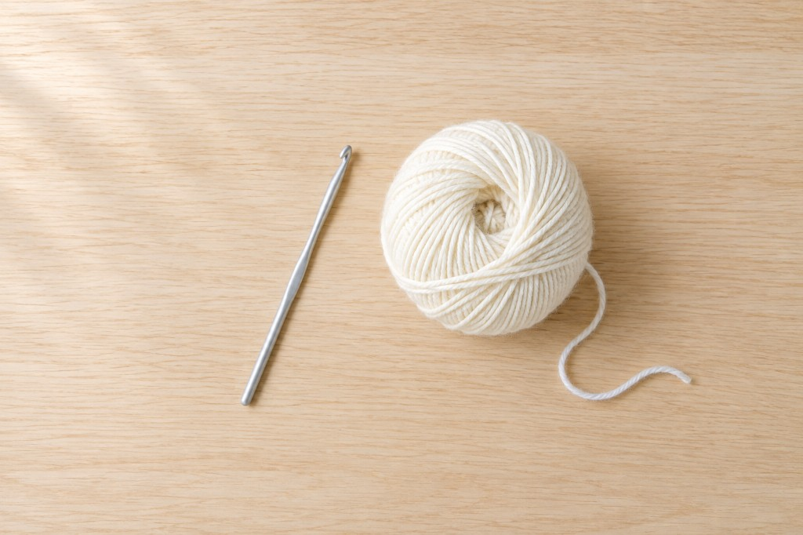
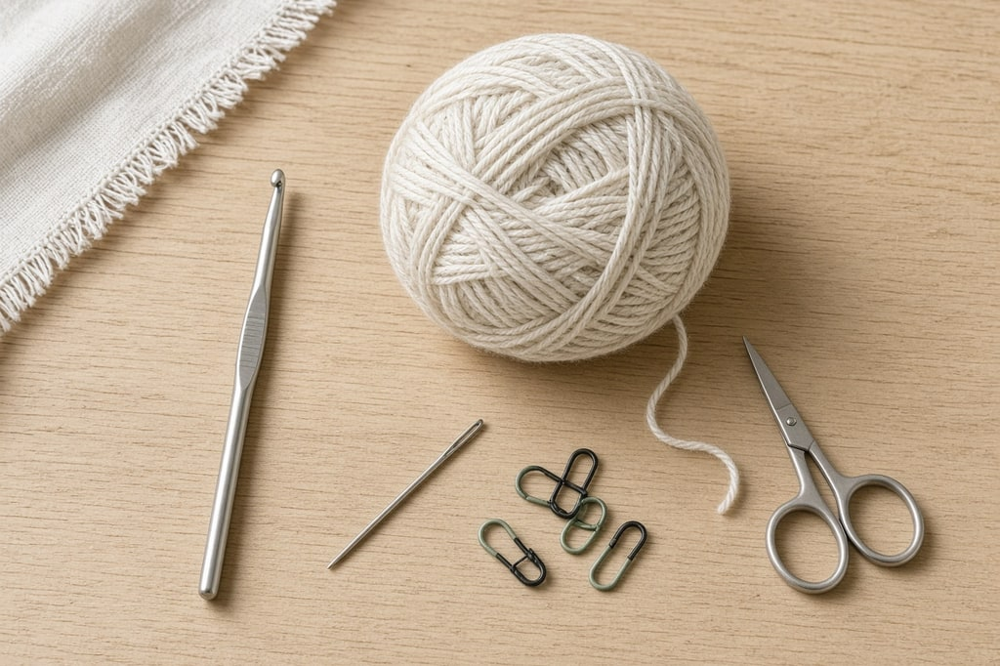
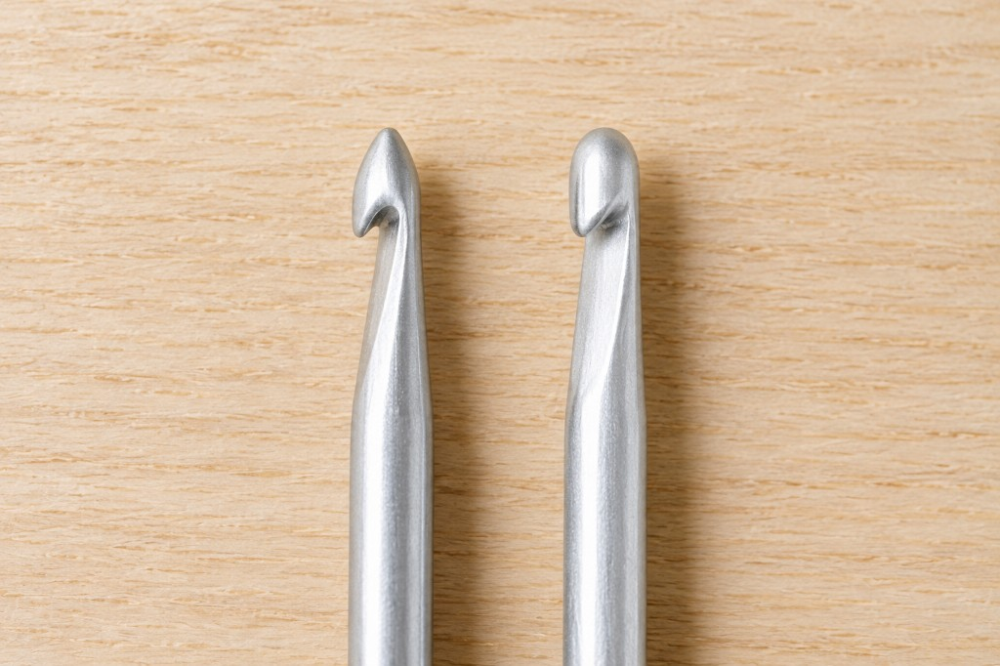
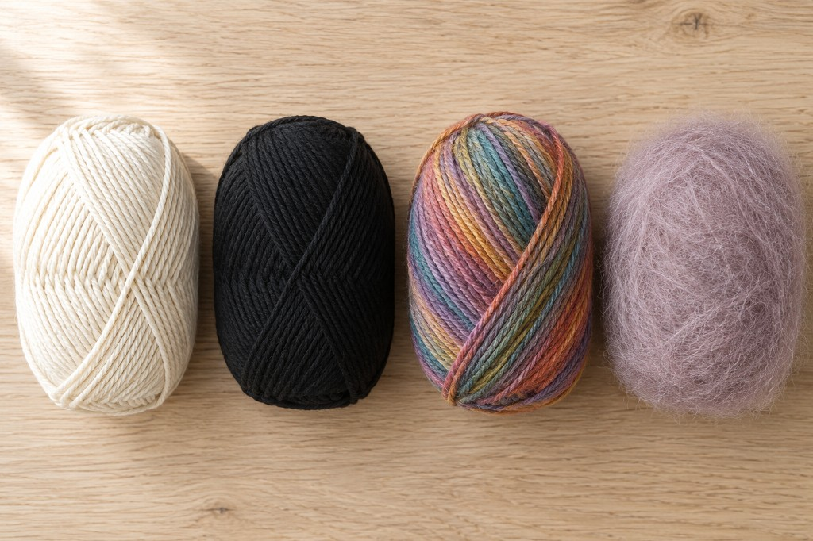
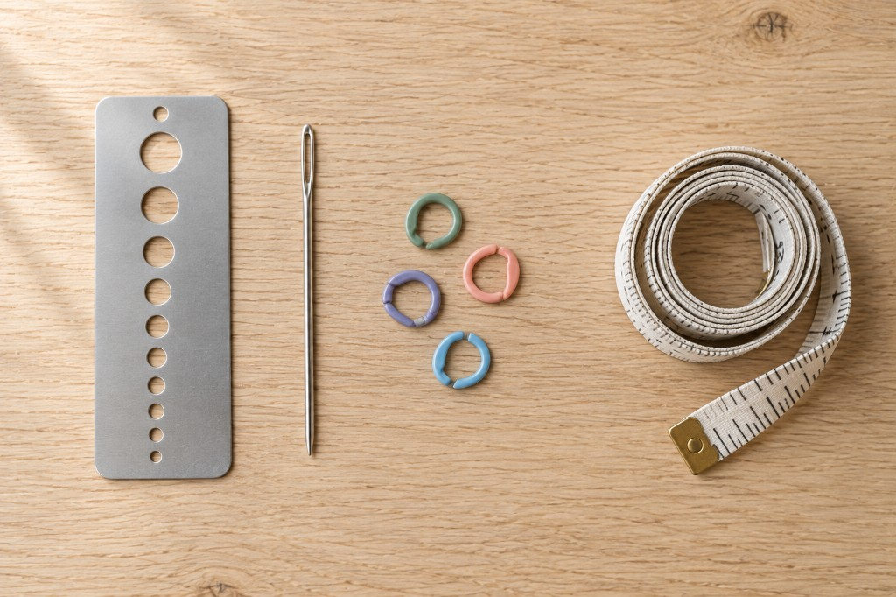

Start with a **5 mm aluminum hook, US size H/8**, and a **medium worsted acrylic in a light solid color**. Together that is under ten dollars, and the light color is what lets you see your stitches.

**Disclosure:** this guide contains affiliate links where products are named, which means a purchase may earn this site a small commission at no extra cost to you. No company sent anything for review and no commission influences what is recommended here. See the [disclosures page](/disclosures/).

## The hook

A 5 mm hook is large enough to see and matches the worsted yarn most beginner patterns assume. A 4 mm feels fiddly. A 6.5 mm exaggerates every tension wobble. Buy one hook until you know which sizes you use.

### Head shape

**Tapered** heads (Boye) have a pointed tip and a throat that narrows gradually. They enter tight stitches easily, and the loop can slip, so size varies a little. **Inline** heads (Susan Bates) sit flush with the shaft, so stitches stay more even. The blunter tip is harder to insert. Buy one of each in 5 mm and keep the shape you prefer.

**Aluminum**, from 2.25 mm through about 10 mm, is the hook to learn on. **Steel** is only for thread below 2.25 mm, and a higher number is a smaller hook. The [hook size chart](/crochet-hook-size-conversion-chart/) lists them. **Plastic and resin** are mostly above about 10 mm. Cheap small plastic hooks can snag. **Wood and bamboo** grip silk, feel slower with acrylic, and are best from about 4 mm up, because smaller wood hooks snap. **Ergonomic** handles cost several times more and help on long sessions. Clover Amour and Tulip Etimo are the mid-priced ranges. Furls is the premium end.

## The yarn

Learn on **medium worsted, category 4**, in a **light solid color** such as cream, light gray, pale blue, or soft yellow, so the loops show. The [yarn weight chart](/yarn-weight-chart/) lists the categories. **Smooth plied acrylic** is springy, machine washable, and cheap to rip out.

Common US worsted acrylics: **Red Heart Super Saver** (stiff until washed), **Lion Brand Basic Stitch** (smoother), **Bernat Super Value**, and **Loops & Threads Impeccable** (Michaels). Dishcloths need worsted cotton, **Lily Sugar'n Cream** or **Peaches & Creme**. Acrylic can melt on a hot pan. Cotton is less forgiving, so make it the second project.

### Yarns that make learning harder

None of these are bad yarns. They are poor teachers. **Black and very dark colors** hide the loops. Save them for your fifth project. **Variegated and self-striping** yarn makes a color change look like a mistake. **Chenille and velvet** split, hide stitches, and can worm into loops that will not lie flat. Wait until your tension is steady. **Fuzzy yarn** (mohair, boucle, eyelash, blanket yarn) covers the loops, and the fibers cling when you undo them. **Sock or fingering weight** is tiny and slow. A scarf can become a three-month project.

## Cotton, acrylic, and wool

**Acrylic** is machine washable, pills, and does not breathe well. It suits blankets, children's items, and amigurumi. **Cotton** stays stretched: right for dishcloths, market bags, coasters, and summer tops. A beanie becomes a bucket. **Wool** blocks into shape for garments and hats. Most is hand wash. Superwash is machine washable and less springy. Cotton in place of acrylic in a garment usually disappoints.

## How much yarn to buy

Buy **yardage, not a skein count.** One brand's large skein can hold more than double another's. Divide the pattern's yards by the yards on the label, add ten percent, and buy it all at once so the dye lots match.

| Project | Approximate yardage |
| --- | --- |
| Dishcloth or coasters | 75–150 yds |
| Adult beanie | 200–300 yds |
| Scarf, 60 in | 400–600 yds |
| Baby blanket | 800–1,200 yds |
| Throw blanket | 1,800–2,800 yds |

Bobbles, puffs, and popcorns use more yarn than plain stitches.

## If your hands hurt

Loosen the yarn hand. Tight tension is what makes you grip. Work about twenty minutes, then stretch. Pencil grip is like a pen. Knife grip is like cutting food. If one hurts, use the other for a full session. A thicker handle, a larger hook, or thicker yarn eases the pinch.

**Persistent numbness, tingling, or pain that wakes you at night is not a hook problem.** Take those symptoms to a doctor. Crochet can aggravate carpal tunnel and tendon issues. It does not cause them, and no handle fixes them.

## The rest of the kit

Buy a **hook gauge** early, a metal plate with holes. It gives the millimeter size when a hook is unlabeled or the print has worn off. Patterns mean millimeters. Letters are not standard between makers.

Add a blunt tapestry needle, split-ring markers, and a tape measure. Keep the ball band pinned to a swatch, in a labeled bag with the leftovers, so a repair still has a fiber and a wash method.

## Mistakes

A 20-piece set before you know tapered from inline. Three sizes cover the first six months, and the wrong head is twenty unused hooks. Lighted and interchangeable hooks are novelties. The light points the wrong way. A plain aluminum hook is enough unless you crochet long hours or your hands hurt. Buy yardage in one dye lot.

## Frequently asked

**Does the hook brand change gauge?** A little. Head shape changes the loop, so finish on the hook you started with.

**Are there left-handed hooks?** Ordinary hooks work in either hand. Some ergonomic thumb rests do not, so check the shape or use a plain hook. More is in the [left-handed guide](/left-handed-crochet/).

**What hook and yarn suit amigurumi?** Worsted acrylic or cotton, with a hook smaller than the label suggests, around 3.5 mm or 4 mm, so the stuffing does not show through.
