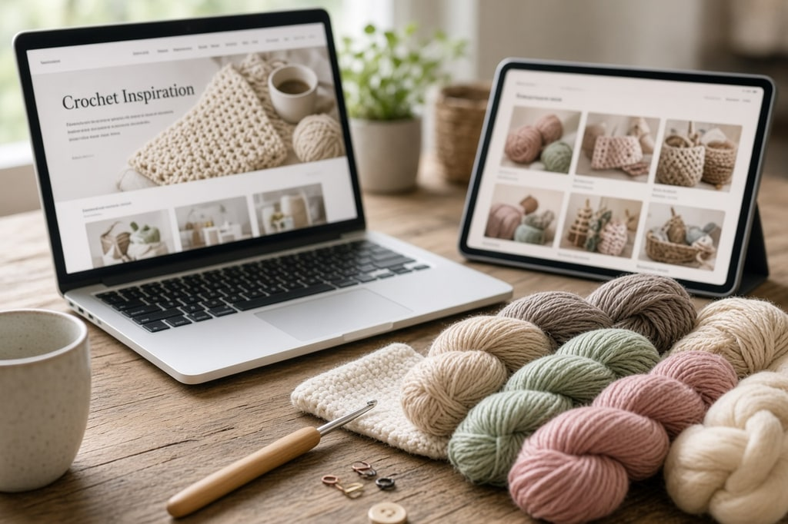
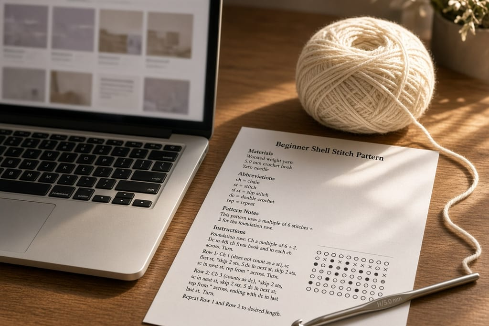
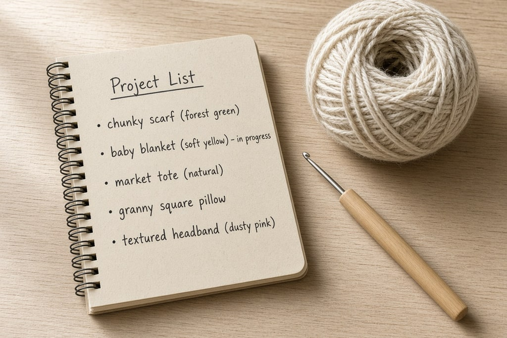

If you are searching for where to find free crochet patterns, the useful answer is a short list of databases, not another board of unsourced photos. A free crochet pattern database either indexes other people's patterns or publishes its own. Those are different jobs, and mixing them up is how a download turns into a dead page.

**Every external link on this page goes to the publisher.** This site does not copy their instructions. The [abbreviations chart](/crochet-abbreviations-chart/) is here when a pattern uses a term you do not know yet.

## The best free crochet pattern databases

Use the table to pick a starting point. "Volume" is a description of the library, not a ranking score. Counts move. Where a site publishes a number, that number is theirs, and it includes whatever crafts they count.

| Site | What it is | Free pattern volume | Filters | Sign-up needed | Best for |
| --- | --- | --- | --- | --- | --- |
| Ravelry | Aggregator database | Indexes designers, publishers, and yarn brands | Craft, free, weight, hook, category | A free account for the full search | Checking that other people have actually made it |
| Lion Brand | Yarn brand | Large free crochet catalog on their pattern pages | Project type and yarn | Account not required to read the pattern | Beginner accessories in their yarns |
| Yarnspirations | Yarn brand | Shared catalog for Red Heart, Bernat, Caron, and Patons | Craft, including crochet | Not required for the pattern download | Blankets and labeled skill levels |
| DROPS Design | Yarn brand | Large combined knit and crochet catalog; their browse page shows the current total | Category and yarn | Not required to open a pattern | Garments, if you can read European terms |
| LoveCrafts | Shop that hosts designers | Mixed free and paid | Free filter | Account for some downloads | Finding an independent designer in one catalog |
| Moogly | Designer site | One designer's long free catalog | By project on the site | No | Photo tutorials with a consistent format |

**[Ravelry](https://www.ravelry.com/patterns/search#craft=crochet&availability=free)** is an aggregator. It does not design the patterns it lists. It stores records that point at the designer's page or a yarn company's page, plus projects other crocheters have logged. Filter by crochet and by free. A free account is what unlocks that search. Before you buy yarn, open the project pages. If several people report the same wrong count, believe the notes.

**[Lion Brand](https://www.lionbrand.com/collections/crochet-patterns)** publishes its own free crochet patterns. Link the crochet pattern collection, not the store homepage. The patterns are written to sell Lion Brand yarn, which is a fine reason for a yarn company to give the pattern away. You can still substitute another yarn of the same weight if you swatch. How to do that is in [crochet gauge](/crochet-gauge/).

**[Yarnspirations](https://www.yarnspirations.com/collections/patterns?filter.p.m.global.skill_type=Crochet)** is the pattern library for Red Heart, Bernat, Caron, and Patons. One crochet filter covers those brands. The old habit of starting at a brand homepage drops you in a shop. Start on the pattern collection.

**[DROPS Design](https://www.garnstudio.com/search.php?action=browse&sort=default)** publishes free knitting and crochet patterns on Garnstudio. The browse page states a combined total, and that total changes, so read the number there instead of trusting a blog that copied it. The patterns are translated and use European hook sizes and, often, UK or international stitch names. Check the [abbreviations chart](/crochet-abbreviations-chart/) and the [hook size chart](/crochet-hook-size-conversion-chart/) before you start a DROPS garment. A US single crochet is not the stitch a UK pattern means by "double crochet."

**[LoveCrafts](https://www.lovecrafts.com/en-us/l/crochet/crochet-patterns)** is a shop with a large mixed library. Use the free filter. The designer is named on the pattern. That name is who you go back to when a round does not add up.

**[Moogly](https://www.mooglyblog.com/free-crochet-patterns/)** is a designer site: one person, a long catalog, photo steps, the same format from one pattern to the next. A designer site is not a database of everyone. It is a good place once you know you like that writer's explanations.

Individual designers also post free patterns on their own domains, with a paid PDF beside them. Quality is uneven. If the explanations suit you, stay with that designer rather than hopping to a random pin.

"Free" on these sites means you do not pay for the PDF. It does not mean the page is free of ads, email offers, or a shop beside the download. That is normal for a yarn brand. Read the pattern. Skip the cart until you know the yardage.

Filters are the point of a database. On Ravelry, set craft to crochet and availability to free before you set a category, or you will be looking at knitting. On Yarnspirations, the crochet skill filter is what keeps knit patterns out of the list. On DROPS, the browse page mixes crafts until you narrow it. A search box alone is not a database. The filters are.

When a filter offers yarn weight, use it. A "free blanket" search that ignores weight is how people buy super-bulky yarn for a worsted pattern. The names of those weights are on the [yarn weight chart](/yarn-weight-chart/). The hook that matches is on the [hook size chart](/crochet-hook-size-conversion-chart/). The pattern's own hook in millimeters wins over either chart when they disagree.

Free patterns are enough to crochet for years. Paying is worth it when a garment is graded in many sizes and you want that editing, and when you want to pay the person whose work you use.

## What a pattern page has to include

A pattern missing several of these will waste the yarn.

- **A gauge statement.** On a garment, no gauge means the size was not planned. A dishcloth can skip it. A sweater cannot. The method is in [crochet gauge](/crochet-gauge/).
- **Total yardage**, not only "3 skeins." Skein lengths differ by brand. The [yarn weight chart](/yarn-weight-chart/) is the language those labels use.
- **Stitch counts** at the end of rows or rounds, written so you can check before row forty.
- **US or UK terminology**, stated. If it is not stated, `sc` usually means US and `htr` means UK.
- **A special-stitches note** when the pattern says bobble, cluster, or shell. Those words are not standard across designers.
- **Finished measurements.**
- **More than one photo**, from more than one angle, of an object that matches the written fabric.

Search the pattern title on Ravelry and read project notes before you commit a weekend. Repeated complaints about the same round are a correction, not a mood.

## How to spot a fake or AI-scam pattern

Pinterest and Facebook are full of crochet pictures that were never made. The link goes nowhere, or the "pattern" is a paragraph that does not produce the object in the photo.

**Look at the stitches.** Real crochet repeats. In a generated picture, stitches melt, change direction for no reason, or turn into the table.

**Look at the hands, if any are shown.** Generated hands are where these pictures fail. A real pattern does not need a hand in the frame to be credible. It needs a gauge, a yarn weight, a hook, and a yardage.

**Check the byline.** A real pattern names a person or a yarn company. A scam names a vibe. If the only credit is the account that posted the pin, leave.

**Open the page, do not stop on the pin.** A pattern page has materials, a hook size in millimeters, and counts. A page that is only an email box is collecting addresses.

**Check the aggregator.** A pattern that has been on the internet will usually have Ravelry projects. Zero projects does not prove a fake. A brand-new designer can have zero. Zero projects plus a picture with impossible stitches is enough to skip it.

**Do not pay a stranger for a "secret" PDF** that the pin describes as free. The databases above are the free ones.

This site's own project photos are labeled as AI illustrations in the caption. That label is the opposite of a scam: the words say the picture is not a finished object. A scam hides that.

## Patterns on this site

Crochet Explained publishes its own tutorials and some written patterns. Those pages are not an aggregator. They do not list every free pattern on the internet, and they do not copy a designer's text. If a page here is a technique, it explains the stitch. If it is a project, the instructions are written for this site and the photos are labeled illustrations. Start at [free patterns](/free-patterns/) if you want what is hosted here, and use the databases above when you want a designer's catalog.

A pattern that has not been crocheted and measured will say so. Treat the inch sizes on those pages as gauge estimates. The stitch counts are still there for you to check as you work.

## How to read the pattern once you have it

Pick one terminology and stay there. The [abbreviations chart](/crochet-abbreviations-chart/) is the lookup. [How to read a crochet pattern](/how-to-read-a-crochet-pattern/) walks a line from hook size to the first repeat.

Write the stitch count at the end of each round in the margin. When your count and the pattern's count disagree, stop. Ripping three rounds is cheaper than ripping thirty.

Save the PDF before the tab closes. Yarn-company pages redesign, and a pattern you meant to make in November is annoying to hunt for in December. Put the designer name in the file name. "blanket-final.pdf" is useless six months later. Ravelry project pages are the other copy: if you log the project, you still have the link when the pin disappears.

For a first project, choose something flat, one color, one stitch, in worsted-weight yarn. A dishcloth or a simple scarf teaches you to follow a row. Shaping and color can wait. The [basic stitches](/basic-crochet-stitches/) page is the order to learn them.

## Frequently asked

### Can I sell what I make from a free pattern?

Often yes, and the answer is on that pattern page, not in a general rule. Yarn-company patterns usually allow finished objects. Selling the pattern text, or posting it as your own, is not allowed.

### What is a good first project from these databases?

Filter for beginner, crochet, and a flat project. Avoid a fitted garment until you have made a [gauge](/crochet-gauge/) swatch on purpose.

### A pattern seems mathematically impossible. Is it me?

Not always. Search the designer's name plus "errata," and read the Ravelry project notes. A wrong count is often already documented.

### Do I need a Ravelry account?

You can browse some pages without one. The filters that make it useful as a free-pattern database ask for a free account. Lion Brand, Yarnspirations, and DROPS Design do not require an account to open the pattern.

### Are AI pictures always a scam?

No. A labeled illustration next to a written pattern is a picture. An unlabeled generated object with no pattern, no designer, and a link that asks for your email is the scam.
