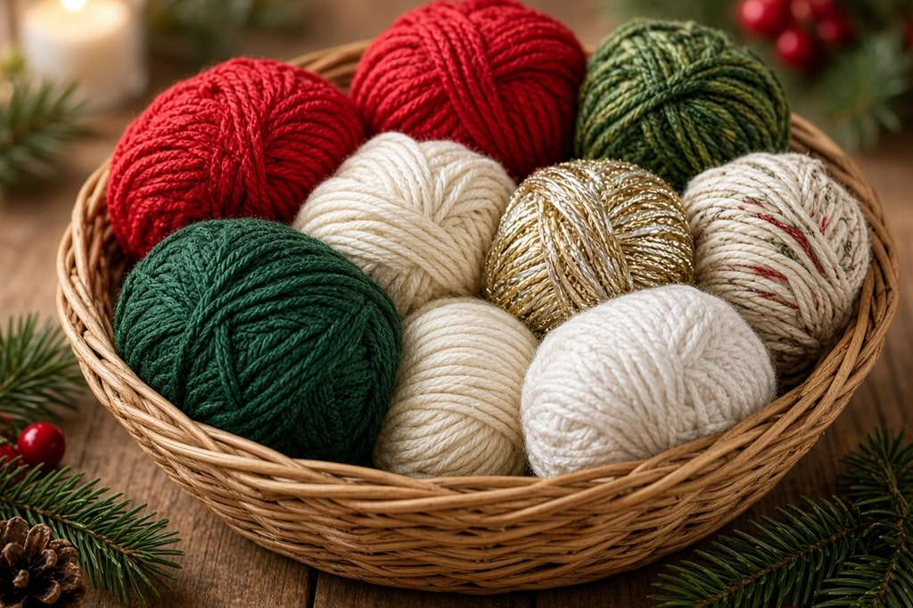
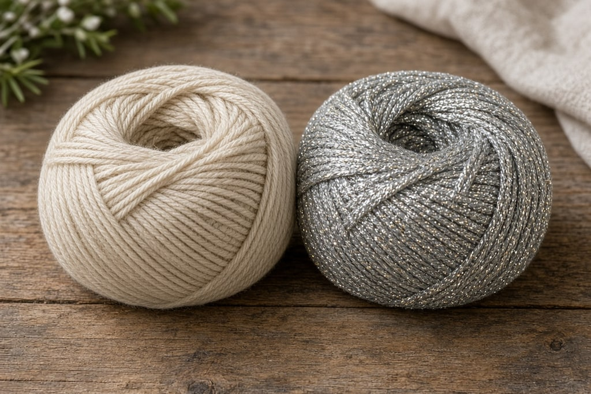
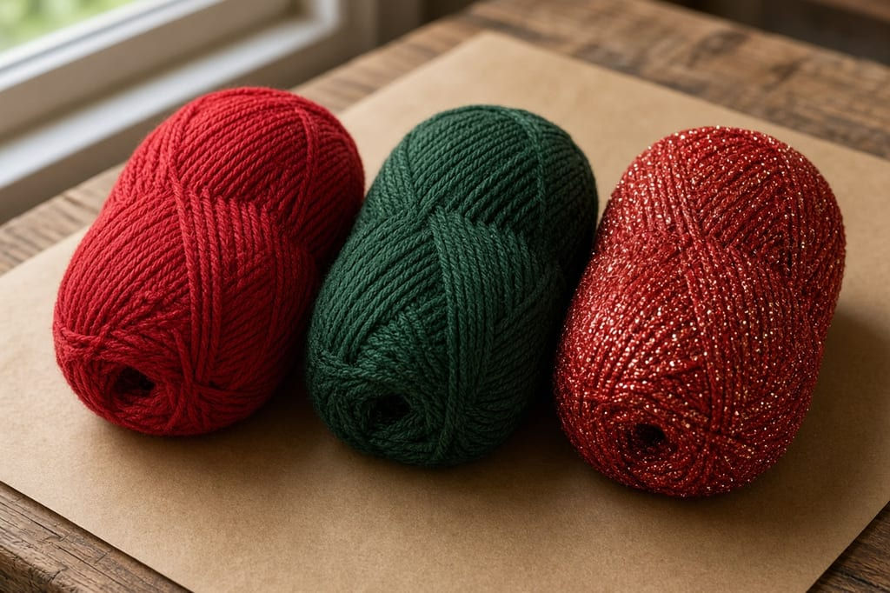

Christmas crochet is mostly small: ornaments, gnomes, snowflakes, coasters, a garland. Drape stops mattering. Stitch definition matters more, and two questions decide the yarn: whether the piece must hold a blocked shape, and whether it will sit near a candle.

**Worsted acrylic for anything stuffed, cotton or thread for anything that must hold a shape, and sparkle as an accent rather than the main yarn.**

**Disclosure:** this guide contains affiliate links where products are named, which means a purchase may earn this site a small commission at no extra cost to you. No company sent anything for review and no commission influences what is recommended here. See the [disclosures page](/disclosures).

## Match the yarn to the job

### Stuffed things — gnomes, Santas, baubles

**Worsted acrylic.** Springy, widely available in red and green, and forgiving of uneven tension on a dense fabric. The elasticity helps the fabric close around stuffing instead of gaping.

Use a hook a size or two smaller than the label suggests, so stuffing cannot show through.

### Things that must hold a shape — snowflakes, stars, flat ornaments

**Cotton, or size 10 crochet thread.** Cotton has no memory. Block it flat and it stays flat. Acrylic springs back, so a stiffened acrylic snowflake slowly curls again over a season. Blocking is covered in [how to crochet a snowflake](/how-to-crochet-a-snowflake).

### Coasters, placemats, potholders

**Worsted cotton.** Absorbent, washable, and it handles a hot mug. Lily Sugar'n Cream and Peaches & Creme are the two US standards, and both come in Christmas colorways each autumn. Acrylic is the wrong fiber for anything that meets heat.

### Garlands and bunting

Either fiber. A garland is a string of small pieces, so leftovers that are useless elsewhere are perfect. Mixing fibers is invisible from across a room.

## The sparkle question

Metallic yarn is usually a fine polyester or nylon filament plied with a normal acrylic strand. That filament is the problem.

**It splits.** The two plies give differently, so the hook slides between them.

**It hides stitch definition.** Sparkle scatters light, so you cannot see where the last stitch ended.

**It can be scratchy.** Fine on an ornament nobody touches. Poor on something worn.

Hold a fine metallic thread together with ordinary worsted. The worsted carries the structure and the stitch definition, and you still get the shimmer. Go up a hook size for the extra thickness. If you work metallic alone, keep it to the last round of an edging.

## Colors that make the work harder

**Deep forest green and dark burgundy swallow stitches.** They photograph well and they are tiring under warm indoor light. For bobbles, cables, or any texture you want to see, go a shade lighter.

**Bright red is hard for phone cameras.** It blows out into a flat shape with no visible stitches. A slightly muted or darker red photographs better.

**White and cream show every mark.** Fine for a snowflake handled twice. Think harder before using them for a coaster.

## Heat and acrylic

**Acrylic melts.** It does not char and go out like wool or cotton. It softens, melts, and can stick to skin. Anything going near a candle, a fireplace, a hot dish, or an oven glove should not be acrylic.

Wool is safer near heat: it has a high ignition point and tends to self-extinguish. Cotton burns but does not melt.

Candle rings, advent wreaths, mantel garlands, and potholders are the projects people make in cheap acrylic without thinking about it. Use cotton or wool near a flame, and never put a crocheted piece directly around a lit candle.

## How much to buy

| Project | Rough worsted yardage |
| --- | --- |
| Single stuffed ornament | 25–50 yds |
| Gnome, desk size | 60–120 yds |
| Snowflake in size 10 thread | 15–25 yds |
| Set of four coasters | 100–150 yds |
| Garland, 6 ft with 10 pieces | 200–300 yds |

One skein covers most of these more than once, so shop leftovers first. For a matched set, buy in one go so the dye lots match. A mismatch is invisible on one ornament and obvious when several hang on the same branch. Weights are in the [yarn weight chart](/yarn-weight-chart).

## Mistakes worth skipping

**Printed novelty yarn.** The print is spaced for a knitted scarf. Crochet uses more yarn per inch, so you get fragments of a motif.

**Chenille or velvet in dark green.** Velvet already hides stitches and worms into loops that will not sit flat. A dark color on top of that leaves you working blind.

**A full Christmas color pack bought on sale in January.** The red and green you need depend on projects you have not chosen yet.

## Frequently asked

### Can I substitute cotton for acrylic in a stuffed ornament?

Yes. Cotton is heavier and has no give, so the fabric is firmer, the piece hangs lower, and uneven tension shows more clearly.

### Is wool worth it?

For anything you block, wool holds the shape better than any other fiber. For a stuffed gnome that lives in a box most of the year, acrylic is the sensible choice, and moths have no interest in it.

### Can I wash a crocheted ornament?

Acrylic and cotton, yes, gently by hand. Anything stiffened with sugar or glue, no. Washing dissolves the stiffener.
