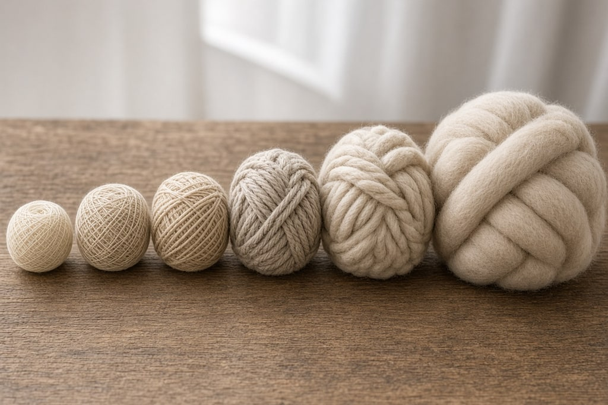
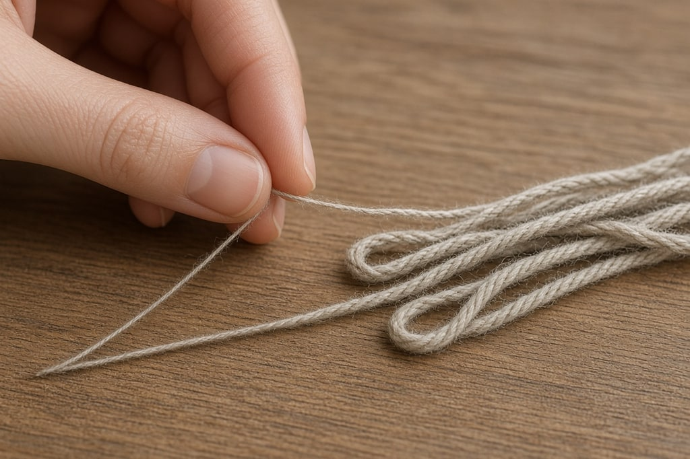
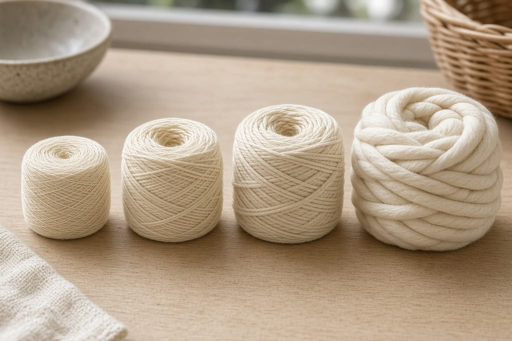

"Yarn weight" means how thick the strand is, not how much the ball weighs. It is the thing to get right when you substitute one yarn for another.

Every country and brand has its own name for the same thickness. What Americans call worsted, the British call aran, the Australians call 10-ply, and the label might just say "medium." The Craft Yarn Council's numbers, 0 through 7, mean the same thing everywhere. That number is usually printed inside a yarn-skein symbol on the ball band.

**If you have an older chart, it probably lists six categories.** The standard was extended to include Jumbo, and lace was separated out as category 0. Charts still showing six groups predate that. Eight is current.

## The chart

Gauge below is single crochet over 4 inches, which is how crochet gauge is conventionally expressed for yarn weight.

| # | Category | Also called | Hook | Gauge (sc / 4 in) |
| --- | --- | --- | --- | --- |
| 0 | Lace | thread, cobweb, 10-count cotton | 1.4–2.25 mm | 32–42 sts |
| 1 | Super Fine | sock, fingering, baby, 4-ply | 2.25–3.5 mm | 21–32 sts |
| 2 | Fine | sport, baby, 5-ply | 3.5–4.5 mm | 16–20 sts |
| 3 | Light | DK, light worsted, 8-ply | 4.5–5.5 mm | 12–17 sts |
| 4 | Medium | worsted, afghan, aran, 10-ply | 5.5–6.5 mm | 11–14 sts |
| 5 | Bulky | chunky, craft, rug, 12-ply | 6.5–9 mm | 8–11 sts |
| 6 | Super Bulky | super chunky, roving | 9–15 mm | 7–9 sts |
| 7 | Jumbo | jumbo, arm-knitting weight | 15 mm and up | 6 sts or fewer |

The hook ranges are starting points. Learn on category 4, worsted: blankets, hats, scarves, amigurumi, dishcloths. Lace is a poor first yarn because you cannot see the stitches. DK is the most useful garment weight. A super-fine blanket is a several-month commitment, and super bulky gets expensive at blanket size.

**Unlabeled yarn:** wrap it around a ruler for one inch, snug but not stretched, and count the wraps. This is wraps per inch. Roughly 8–11 wraps is bulky, 12–14 is worsted, 15–17 is DK, 18–24 is sport or fingering. Not precise, but enough to tell whether a ball is in the right neighborhood.

## Substituting one yarn for another

The yarn a pattern names is often discontinued. Match these, in order.

**1. The weight number.** Substituting a category 3 for a category 4 changes the finished size.

**2. Total yardage, not the number of balls.** "3 skeins" means nothing on its own, because skein sizes differ between brands. One brand's 7 oz skein can hold more than double another's 3.5 oz. Find the total yards or meters, divide by the yardage on the yarn you are buying, and add ten percent. Buy it all at once so the dye lots match.

**3. The fiber.** Acrylic is springy, machine washable, and holds its shape: blankets, kids' items, amigurumi. Cotton has no memory, so a cotton hat stretches and stays stretched. It suits dishcloths, bags, and summer tops. Wool is warm, elastic, and blocks well, and most of it needs hand washing. Acrylic is the right yarn for a blanket a toddler will drag around. For a garment you will wear for years, the fiber is most of what you are paying for.

**4. The gauge.** Two yarns in the same category can still differ by a stitch or two over 4 inches. Swatch after you substitute.

For amigurumi, use a smaller hook than the label so stuffing does not show through: worsted on a 3.5 mm or 4 mm hook, rather than the suggested 5.5 mm. For blankets and shawls, go one size up. At the label's gauge they often come out stiff.

## How much yarn a project needs

Rough figures in category 4 worsted, for planning:

| Project | Approximate yardage |
| --- | --- |
| Dishcloth or coaster set | 75–150 yds |
| Beanie, adult | 200–300 yds |
| Scarf, 60 inches | 400–600 yds |
| Baby blanket, 30 x 40 in | 800–1,200 yds |
| Throw blanket, 50 x 60 in | 1,800–2,800 yds |
| Adult sweater | 1,000–1,800 yds |

Dense single crochet can use half again as much yarn as an open double crochet mesh over the same area. Bobbles, puffs, and popcorns use the most. Buy one extra ball. Returning it is easier than matching a dye lot three weeks later.

## Common mistakes

**Buying "3 skeins," or using a six-category chart.** Match the weight number and the total yardage. Current charts run from lace at 0 through jumbo at 7.

**Changing the fiber and skipping the swatch.** A cotton hat stretches and stays stretched. Two yarns in one category can still differ by a stitch or two over 4 inches.

## Frequently asked

**What does "4-ply" or "8-ply" mean?** It is the Australian and New Zealand system, and it means thickness, not the literal number of strands. 4-ply is roughly fingering, 8-ply is roughly DK, 10-ply is roughly worsted.

**Why is my hat too big when I followed the pattern exactly?** Almost always gauge. Your tension is looser than the designer's, so go down a hook size. [Gauge is covered here](/how-to-read-a-crochet-pattern/).

**Can I hold two thin yarns together to make a thicker one?** Yes. Two strands of DK held together behave roughly like a chunky. Swatch it, because the result is never exactly what the arithmetic suggests.
